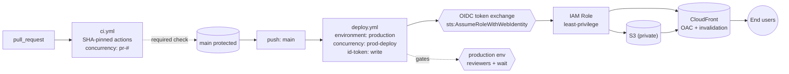

# Enterprise Stage — Cloud CI/CD with GitHub Actions

## Stage banner

Enterprise stage, FEM segments 12–15. Time block 3:00 PM to 4:30 PM.

This stage hardens the Stable pipeline (sample app: TDD §4; end-of-Stable repo state: TDD §8.2) into one that meets the security and operational bar a regulated organization expects. Four changes land in this 90-minute block:

- A `production` environment with required reviewers and a wait timer gates the deploy job.
- OIDC replaces the long-lived IAM user access key. The deploy job assumes an IAM role at runtime via a short-lived token issued by GitHub.
- CloudFront with Origin Access Control fronts the S3 bucket. The bucket is no longer public-read.
- Third-party actions are pinned to full 40-character commit SHAs. Workflow `permissions:` are tightened to deny-all by default. Concurrency groups are added to both workflows. Self-hosted runners are discussed but not demonstrated.

By 4:30 PM students have observed the same `dist/` artifact ride a third pipeline — one they could put in front of a security review.

## Completed reference

The end-of-Enterprise state described in this doc — SHA-pinned actions, OIDC trust, environment-gated deploys, CloudFront with Origin Access Control, deny-all workflow permissions, and concurrency groups — lives on the `enterprise` branch.

`enterprise` is branched from `stable`, so the workshop progression is linear: `git diff enterprise..stable` shows exactly what segments 12–15 transform.

**Important caveat:** the SHA-pinning excerpts on the `enterprise` branch use the literal placeholder string `<40-char-sha>` (see the read-only excerpt later in this doc, segment 14, "Action pinning") — they are NOT real 40-character SHAs. The instructor pins real SHAs at workshop date as part of the dry-run, not pre-commit.

For the supporting AWS-side setup that this branch assumes already exists — OIDC provider, IAM role and trust policy, CloudFront distribution with OAC, and the `production` environment configuration — see `README.md` on the `enterprise` branch.

## Pre-flight (specific to this stage)

The OUTLINE pre-flight checklist (`OUTLINE.md` → "Pre-flight checklist") is the canonical list. The items below must already be true at the start of segment 12. They are pre-staged outside the workshop because each one would blow the time budget if performed live.

- The IAM role for OIDC is pre-created. Its trust policy targets `token.actions.githubusercontent.com` with a `sub` condition binding to `repo:<owner>/<repo>:environment:production`. Trust-policy shape: TDD §6.4. The role's permission policy mirrors the IAM user from POC plus `cloudfront:CreateInvalidation` on the demo distribution. Role ARN is in the instructor's notes pane, not on screen.
- The GitHub Actions OIDC provider trust is pre-configured in AWS IAM (the `arn:aws:iam::<ACCOUNT_ID>:oidc-provider/token.actions.githubusercontent.com` resource exists). Creating it live would need an `iam:CreateOpenIDConnectProvider` API call and an audience-and-thumbprint dance that does not teach anything the IAM trust policy does not already teach.
- A CloudFront distribution exists with the S3 bucket as origin via OAC. It is in `Disabled` state. Segment 13 enables it live. Pre-staging avoids the 10–15 minute distribution-creation propagation that would consume the entire OIDC segment.
- The S3 bucket policy is currently the public-read policy from POC and Stable. Segment 13 flips it to the OAC-only policy. The replacement bucket-policy text is in the instructor's notes pane.
- The Stable end-state is committed and green. The `stable` branch matches what is on `main`; the `enterprise` branch is the safety net if any segment 12–15 step runs over time.
- Long-lived `AWS_ACCESS_KEY_ID` and `AWS_SECRET_ACCESS_KEY` repository secrets are still present going into segment 12. They are removed live in segment 13 to make the OIDC switch visible — and only *after* a deploy has succeeded via OIDC, so the old auth path is never torn down before the new one is proven working.

If any item above is not true, do not start segment 12 — the OIDC segment will fail and the rest of the stage cascades. Switch to the `enterprise` branch and walk it as a static read.

## Segment 12 — 3:00 — Environments & Protection Rules

### Talking points

- A GitHub environment is a named bundle of protection rules and secrets attached to a repository. A job opts in by setting `environment: <name>`. The environment's rules then govern when and how that job is allowed to run.
- The two protection rules that matter for deploys are required reviewers (a deploy job pauses until a named human approves it) and a wait timer (a deploy job sleeps a configurable number of minutes before starting, giving the team a chance to abort). Branch restrictions exist as a third rule but are redundant once `main` is already protected.
- Environments also scope secrets. A secret defined under the `production` environment is only visible to a job whose `environment:` is `production`. This is the "blast radius" lever — secrets do not leak to PR-triggered jobs that have no business seeing them.
- Multi-environment promotion is the natural extension of this idea: `staging` and `production` environments, both gated, with deploy-to-staging-then-promote-to-production wiring. We are not live-building it today (per OUTLINE design choice). If a student asks, the answer is "you would add a `staging` environment with the same shape; we are skipping it to stay in the 30-minute budget."
- Why this segment is first in Enterprise: the `production` environment is the principal that the OIDC trust policy binds to in segment 13. Segment 12 establishes the binding target; segment 13 wires up the binding.

### Live build

Each step is one observable action.

1. In GitHub repository settings, click "Environments", then "New environment", name it `production`, and create it.
2. On the new environment's settings page, enable "Required reviewers" and add the demo account (the instructor's account is fine for the demo; in production this would be one or more team accounts that are not the deployer).
3. Enable "Wait timer" and set it to 1 minute. Note that 30 minutes is more realistic in production, but 1 minute keeps the demo watchable.
4. Open `.github/workflows/deploy.yml` in the editor (current state is the end-of-Stable shape, see TDD §8.2).
5. On the `deploy` job, add `environment: production` as a top-level job key. The placement is shown in the read-only excerpt below.
6. Commit the change to a feature branch, open a PR, merge it. On merge, the deploy workflow runs; the `deploy` job pauses on "Waiting for review."
7. Switch to the GitHub Actions run page. Click "Review deployments", select the `production` environment, and approve. The wait timer counts down. The deploy job starts.
8. Observe the deploy succeed against S3 (still using the long-lived IAM user key — the OIDC switch is segment 13's payoff).

```yaml
# .github/workflows/deploy.yml — Enterprise stage, end of segment 12
# Read-only excerpt. Sample app spec: TDD §4. Stable end-state: TDD §8.2.
# Only the addition is the `environment: production` line on the deploy job.
# Long-lived AWS credentials still in use here. They go away in segment 13.
name: Deploy
on:
  push:
    branches: [main]
jobs:
  build:
    uses: ./.github/workflows/_build.yml
  deploy:
    needs: build
    runs-on: ubuntu-latest
    environment: production
    steps:
      - uses: actions/download-artifact@v4
        with:
          name: dist
          path: dist
      - uses: aws-actions/configure-aws-credentials@v4
        with:
          aws-access-key-id: ${{ secrets.AWS_ACCESS_KEY_ID }}
          aws-secret-access-key: ${{ secrets.AWS_SECRET_ACCESS_KEY }}
          aws-region: us-east-1
      - run: aws s3 sync dist/ s3://<example-bucket>/ --delete
```

### Common questions / Gotchas

- **Q: "Why don't I see the environment in the deploy job's run UI?"** Because the workflow file does not declare `environment:` on the job. Confirm the YAML key sits at the job level, not the step level — pasting it under `steps:` is a common typo and produces no error.
- **Q: "Can I be the reviewer for my own deploy?"** GitHub allows it for the demo, but the option "Prevent self-review" exists on the environment and would normally be on. We are leaving it off here so the workshop can run with one human.
- **Q: "What happens if the wait timer is 30 minutes and we cancel the deploy?"** The job is cancelled mid-wait. Nothing was deployed. The wait timer is a safety brake, not a queue.
- **Q: "Why does Required Reviewers / wait timer / deployment branches work for us if we're on the Free GitHub plan?"** GitHub Environments and their protection rules (Required Reviewers, wait timers, deployment branch policies) are free for *public* repositories. They require a paid plan (Pro / Team / Enterprise) for *private* repos. The workshop's reference repo is public, which is why every demo here works on Free plan. If you fork this into a private repo on Free plan, segment 12's environment-protection UI will be greyed out — that is not a bug, it is a billing line.
- **Gotcha:** Do not set the wait timer above 5 minutes during the live demo. The workflow page shows a count-down, and 30 minutes of dead air is a worse demo than skipping the wait timer entirely.
- **Gotcha:** If branch protection on `main` is missing (Stable should have set it), the deploy fires from a direct push and the environment gate still fires — but you have lost the PR-merge story. Confirm `main` is still protected before this segment.
- **Gotcha:** Environment names are case-sensitive in the `sub` condition you write into the IAM trust policy in segment 13. Pick `production` (lowercase) here and stick with it. Renaming the environment after segment 13 means rewriting the trust policy.

### Transition

The deploy job is gated on a human now. But the deploy still authenticates with a long-lived AWS access key sitting in a GitHub secret. Segment 13 removes that key entirely and replaces it with a short-lived token issued by GitHub at the moment the deploy starts.

## Segment 13 — 3:30 — OIDC & Cloud Authorization

### Talking points

- An OIDC token is a short-lived, cryptographically signed claim about *what is running this workflow*. GitHub mints one for the workflow at runtime; AWS verifies the signature and reads the claims (`repo`, `ref`, `environment`, `sub`, `aud`); if the claims match the IAM role's trust policy, AWS exchanges the OIDC token for short-lived AWS credentials. The job uses those credentials and they expire in an hour.
- The keys never sat in GitHub. They never sat anywhere. Removing the `AWS_ACCESS_KEY_ID` and `AWS_SECRET_ACCESS_KEY` secrets removes a leak surface that does not need to exist. This is OWASP CICD-SEC-2 (insufficient flow control mechanisms) and CICD-SEC-6 (insufficient credential hygiene) addressed in one move.
- The IAM trust policy is where least privilege at the principal level lives. The trust policy says "I will trade an OIDC token for credentials *if and only if* the token was issued for this exact repository, this exact environment, and this exact audience." A leaked workflow file from another repository cannot mint credentials for our role.
- The workflow side has two new pieces: a `permissions:` block granting `id-token: write` (so the runner can request the OIDC token) and `contents: read` (so it can `actions/checkout`); and `aws-actions/configure-aws-credentials` configured with `role-to-assume` and `aws-region` instead of access keys.
- CloudFront with Origin Access Control closes the matching loop on the storage side. The S3 bucket goes private; only the CloudFront distribution's OAC service principal can read objects. The deploy job adds a `cloudfront:CreateInvalidation` step so users see the new content immediately rather than waiting for the CDN's TTL.
- This segment is the keystone of the Enterprise stage. Every other Enterprise change (segment 12's environment, segment 14's hardening, segment 15's concurrency) makes more sense once OIDC has landed.

### Live build

This segment has the most moving parts of any Enterprise concept. Four changes land in sequence: trust policy on the AWS side, workflow permissions on the GitHub side, provider-action config on the GitHub side, CloudFront enablement and bucket policy flip on the AWS side. If time runs short, the OIDC switch is the priority — the CloudFront enablement can be shown via screenshot.

The ordering below is defense-in-depth: the workflow is migrated to OIDC first, OIDC is proven working with a real deploy, and *only then* are the long-lived secrets deleted. Never tear down the old auth path before the new one is proven — between "secrets deleted" and "workflow updated," any push to `main` would break the deploy.

1. Open the AWS IAM console (in the instructor's notes window, not on the main screenshare — the role ARN is sensitive). Navigate to the pre-staged role and show its trust policy. The trust-policy shape is read-only excerpt below.
2. Walk the trust policy aloud: `sts:AssumeRoleWithWebIdentity`, federated principal is the GitHub OIDC provider in this account, `aud` must equal `sts.amazonaws.com`, `sub` must match the workshop repo and the `production` environment.
3. Switch to the GitHub repository settings, "Secrets and variables" → "Actions". Add a repository variable named `AWS_ROLE_TO_ASSUME` whose value is the IAM role ARN. A variable (not a secret) is fine because the role ARN is not sensitive — the trust policy is what protects the role. Leave the long-lived `AWS_ACCESS_KEY_ID` and `AWS_SECRET_ACCESS_KEY` secrets in place for now; they stay until OIDC is proven working.
4. Open `.github/workflows/deploy.yml`. Add a workflow-level `permissions:` block setting `id-token: write` and `contents: read`. Adding it at workflow level means jobs inherit it; the explicit deny-all + per-job grants pattern lands in segment 14.
5. In the `deploy` job's `aws-actions/configure-aws-credentials` step, replace the `aws-access-key-id` and `aws-secret-access-key` inputs with `role-to-assume: ${{ vars.AWS_ROLE_TO_ASSUME }}`. Keep `aws-region`. The workflow no longer reads the long-lived secrets, but the secrets are still in the repo as a safety net.
6. Commit the workflow change to a feature branch, open a PR, merge it. Approve the environment gate on the resulting deploy run. Watch the configure-aws-credentials step log — it now shows "Assuming role" and the OIDC token exchange. The `aws s3 sync` step uses the assumed-role credentials and succeeds. *OIDC is now proven working in production.*
7. Only now that OIDC has succeeded end-to-end, return to "Secrets and variables" → "Actions" and delete `AWS_ACCESS_KEY_ID`. Delete `AWS_SECRET_ACCESS_KEY`. The list is now empty for AWS credentials. The old auth path is gone; the workflow is OIDC-only.

> *Time budget checkpoint: at end of step 7 you should be at ~3:50 PM. The OIDC migration is complete and the long-lived secrets are gone — the keystone of this segment has landed. If you are already at 4:00 PM, STOP HERE. Steps 8–11 (CloudFront enable, bucket-policy flip, invalidation step) can be skipped on stage and shown via screenshot of the pre-staged distribution. Segment 14 starts at 4:00 PM and does not absorb overrun.*

8. CloudFront switch. Open the CloudFront console; locate the pre-staged distribution; click "Enable". The status changes to "Deploying" — propagation takes 5–10 minutes, but the distribution is usable as soon as the status flips to "Deployed."
9. While CloudFront propagates, flip the S3 bucket policy. Open the bucket's "Permissions" tab; replace the public-read policy with the OAC-only policy from the instructor's notes pane. The bucket is now private; direct S3 URLs return `AccessDenied`. The CloudFront URL serves the same content.
10. Add a `cloudfront:CreateInvalidation` step to the deploy job, after the `aws s3 sync`. It calls `aws cloudfront create-invalidation --distribution-id <dist-id> --paths "/*"`. The role's permission policy already has `cloudfront:CreateInvalidation` on this distribution.
11. Push a trivial change (edit `index.astro` to read "Hello, workshop"). The pipeline runs; the deploy job sync'es to S3, invalidates CloudFront, and the new content is live behind the CDN.

```text
# IAM trust policy — Enterprise stage, segment 13.
# JSON-shaped read-only excerpt described in markdown. Never extracted to a .json file.
# Trust-policy shape source of truth: TDD §6.4.
# Replace placeholders: <ACCOUNT_ID> with the AWS account ID; <owner>/<repo> with the GitHub repo path.
{
  "Version": "2012-10-17",
  "Statement": [
    {
      "Effect": "Allow",
      "Principal": {
        "Federated": "arn:aws:iam::<ACCOUNT_ID>:oidc-provider/token.actions.githubusercontent.com"
      },
      "Action": "sts:AssumeRoleWithWebIdentity",
      "Condition": {
        "StringEquals": {
          "token.actions.githubusercontent.com:aud": "sts.amazonaws.com"
        },
        "StringLike": {
          "token.actions.githubusercontent.com:sub": "repo:<owner>/<repo>:environment:production"
        }
      }
    }
  ]
}
```

```yaml
# .github/workflows/deploy.yml — Enterprise stage, end of segment 13
# Read-only excerpt. Long-lived AWS credentials are gone. Permissions block is set at workflow level.
# CloudFront invalidation lands in the deploy job. SHA-pinning happens in segment 14 (still major-tag here).
name: Deploy
on:
  push:
    branches: [main]
permissions:
  id-token: write
  contents: read
jobs:
  build:
    uses: ./.github/workflows/_build.yml
  deploy:
    needs: build
    runs-on: ubuntu-latest
    environment: production
    steps:
      - uses: actions/download-artifact@v4
        with:
          name: dist
          path: dist
      - uses: aws-actions/configure-aws-credentials@v4
        with:
          role-to-assume: ${{ vars.AWS_ROLE_TO_ASSUME }}
          aws-region: us-east-1
      - run: aws s3 sync dist/ s3://<example-bucket>/ --delete
      - run: aws cloudfront create-invalidation --distribution-id <DISTRIBUTION_ID> --paths "/*"
```

### Common questions / Gotchas

- **Q: "Why is `id-token: write` not the default?"** GitHub defaults to a restricted `GITHUB_TOKEN` scope to keep workflows minimum-privilege. Workflows that do not need to mint OIDC tokens never get the capability. The explicit grant is the security pattern, not the inconvenience.
- **Q: "What stops another repo from assuming this role?"** The `sub` condition in the trust policy. `StringLike` on `repo:<owner>/<repo>:environment:production` rejects any token whose `sub` claim does not match. A workflow file copy-pasted into a fork will receive a token whose `sub` is `repo:<fork-owner>/<repo>:...`, which fails the condition.
- **Q: "Why bind to the `production` environment in `sub` and not just to a branch?"** Both options work. Binding to the environment makes the segment 12 work load-bearing — the role only minted credentials when the deploy job actually entered the environment, which is the gated path. Binding only to `refs/heads/main` is also valid but bypasses the environment story.
- **Q: "How long are the AWS credentials valid?"** One hour by default. The workflow run takes minutes; the credentials expire long before they could be exfiltrated and replayed.
- **Q: "Why `vars.AWS_ROLE_TO_ASSUME` and not `secrets.AWS_ROLE_TO_ASSUME`?"** Repository variables are visible in logs and to anyone with read access to repository settings. Secrets are encrypted at rest and redacted from logs. The role ARN is just an identifier — it is not sensitive on its own; the trust policy is what protects the role. Reserve `secrets.` for things whose disclosure is harmful (the long-lived access key from the POC stage was the canonical example). Mis-classifying a non-secret as a secret is harmless but mis-classifying a secret as a variable is a leak; pick the namespace based on what would happen if the value showed up in a public log.
- **Gotcha:** The OIDC provider must already exist in the AWS account. Creating it live needs `iam:CreateOpenIDConnectProvider` and an audience-and-thumbprint dance that does not teach anything new. Pre-staged in OUTLINE pre-flight.
- **Gotcha:** The trust policy's `sub` is case-sensitive on the environment name. If segment 12 named the environment `Production` and the trust policy says `production`, the role refuses to assume and the failure message is unhelpful — the AWS console says only "AccessDenied." Verify the environment name matches before pushing.
- **Gotcha:** Do not show the role ARN on the main screenshare more than necessary. While the ARN is not a secret, an attacker with the ARN plus knowledge of your repo can attempt a confused-deputy attack against any other AWS account that trusts your repo path.
- **Gotcha:** CloudFront propagation is not instant. After enabling the pre-staged distribution, the first request through the CDN may take 5–10 minutes to start serving. Have the screenshot of "deployed" state ready if the demo cannot wait.
- **Gotcha:** Once the bucket policy is flipped to OAC-only, the direct `s3.amazonaws.com/<bucket>/index.html` URL returns `AccessDenied`. This is correct, but it surprises students who learned the public-read URL during POC. Clarify that the CloudFront URL is the new public surface.
- **Gotcha:** The `cloudfront:CreateInvalidation` IAM action is per-distribution; check the role's permission policy uses the demo distribution's ARN, not `*`. A wildcard works for the demo and would be a finding in a security review.

### Transition

OIDC and CloudFront are landed. The pipeline now authenticates with short-lived credentials and serves through a CDN with a private origin. Two security gaps remain: third-party actions in our workflow are pinned to mutable major-version tags (`@v4` can be re-pointed by the publisher to malicious code at any time), and the workflow has more permissions than it strictly needs. Segment 14 closes both gaps.

## Segment 14 — 4:00 — Hardening Your Workflows

### Talking points

- A version tag like `actions/checkout@v4` is a Git tag, and Git tags are mutable. The publisher can re-point `v4` to any commit at any time. A compromised publisher account can re-point `v4` to malicious code, and every workflow on the planet that pins to `@v4` re-fetches that code on its next run. This is OWASP CICD-SEC-3 (third-party action integrity).
- Pinning to a 40-character commit SHA freezes the action at exactly the code we reviewed. The trade-off is that a new release means a manual update — version drift becomes visible because the SHA changes — but that is the security property we want, not a regression.
- The SHA-comment convention preserves human readability. `actions/checkout@<40-char-sha> # v4.1.7` reads as "checkout pinned to commit <sha>, which was tagged v4.1.7 at the time we pinned it." The comment is not load-bearing for the runner; it is for the next human.
- The `permissions:` block at workflow level should be deny-all by default. Each job grants only what it needs. Most jobs need `contents: read` (so checkout can clone). Only the deploy job needs `id-token: write`. Other token capabilities (`pull-requests: write`, `issues: write`, `packages: write`) stay denied because no job in this workflow uses them. This is OWASP CICD-SEC-1 (insufficient identity and access management).
- Why deny-all and not just unset? An unset `permissions:` block inherits the runner's default token, which historically has been more permissive than necessary. Deny-all is the explicit, audit-friendly state. A reviewer can read the workflow file and answer "what can this workflow do?" without consulting GitHub's defaults table.

### Live build

This segment is mechanical: find each `uses:` and re-pin it. Do not skip the comment.

1. Open `.github/workflows/_build.yml`. Find every `uses:` line.
2. For each marketplace action, look up its current release on GitHub, find the commit SHA for the release tag, and rewrite the `uses:` line as `<owner>/<action>@<40-char-sha> # <semver-tag>`. The actions to repin in this workshop are listed in the read-only excerpt below.
3. Repeat in `.github/workflows/ci.yml`. The same actions appear; they pin to the same SHAs.
4. Repeat in `.github/workflows/deploy.yml`. Note that `aws-actions/configure-aws-credentials` is a first-party AWS action; pin it the same way for consistency.
5. Repeat in `.github/actions/build-astro/action.yml` (the composite action from Stable). Internal `uses:` references inside a composite action also pin to SHAs.
6. Open `.github/workflows/deploy.yml`. Replace the workflow-level `permissions:` block from segment 13 with a deny-all default plus per-job grants. The `build` job inherits or sets `contents: read`; the `deploy` job adds `id-token: write` on top of `contents: read`.
7. Repeat the per-job permissions pattern in `ci.yml` and `_build.yml`. CI's `build` job needs `contents: read`. The reusable `_build.yml` declares `contents: read` at workflow level so callers do not have to think about it.
8. Commit. Push. The pipeline runs; SHAs pull the same code as before; behavior is identical; the workflow file is now reviewable by a security team.

```yaml
# Action pinning — Enterprise stage, segment 14.
# Read-only excerpt. The five actions below appear across _build.yml, ci.yml, deploy.yml, and build-astro/action.yml.
# SHAs shown as placeholders — the instructor looks up real SHAs at workshop time and pastes them in.
# SHA-comment convention source of truth: TDD §5.3.
- uses: actions/checkout@<40-char-sha> # v4.1.7
- uses: actions/setup-node@<40-char-sha> # v4.0.3
- uses: actions/upload-artifact@<40-char-sha> # v4.3.6
- uses: actions/download-artifact@<40-char-sha> # v4.1.8
- uses: aws-actions/configure-aws-credentials@<40-char-sha> # v4.0.2
```

```yaml
# .github/workflows/deploy.yml — Enterprise stage, end of segment 14
# Read-only excerpt. Workflow-level permissions are deny-all; per-job grants only what is needed.
# Action pins (`<40-char-sha>`) elided here for readability — see the action-pinning excerpt above.
name: Deploy
on:
  push:
    branches: [main]
permissions: {}
jobs:
  build:
    uses: ./.github/workflows/_build.yml
    permissions:
      contents: read
  deploy:
    needs: build
    runs-on: ubuntu-latest
    environment: production
    permissions:
      id-token: write
      contents: read
    steps:
      - uses: actions/download-artifact@<40-char-sha> # v4.1.8
        with:
          name: dist
          path: dist
      - uses: aws-actions/configure-aws-credentials@<40-char-sha> # v4.0.2
        with:
          role-to-assume: ${{ vars.AWS_ROLE_TO_ASSUME }}
          aws-region: us-east-1
      - run: aws s3 sync dist/ s3://<example-bucket>/ --delete
      - run: aws cloudfront create-invalidation --distribution-id <DISTRIBUTION_ID> --paths "/*"
```

### Common questions / Gotchas

- **Q: "How do I find the SHA for a release?"** On the action's GitHub repository, navigate to the "Releases" page, click the release, then click the commit SHA shown next to the tag. Copy the full 40-character SHA. Or run `git ls-remote https://github.com/<owner>/<action> refs/tags/<tag>` from a terminal.
- **Q: "How do I keep these up to date?"** Dependabot supports SHA-pinned actions and can open PRs that bump both the SHA and the version comment together. Configure `version: 2` in `.github/dependabot.yml` with `package-ecosystem: github-actions`. Out of scope for this segment but worth a one-line mention.
- **Q: "What if a marketplace action doesn't tag releases?"** Pin to the SHA of the commit you reviewed, with a comment naming the date or the PR you reviewed (`# reviewed 2026-04-26`). If the action does not even have releases, raise the bar on whether to use it — that is a CICD-SEC-3 signal in itself.
- **Q: "Do I need to pin first-party AWS or actions/* actions?"** Strictly, GitHub-published `actions/*` and major-cloud-published `aws-actions/*` actions are lower-risk than community actions because the publisher's account is high-value and well-monitored. The workshop pins them anyway for consistency — a reviewer reading the workflow file should not have to ask "why is this one different?"
- **Gotcha:** Do not forget the composite action at `.github/actions/build-astro/action.yml`. Its internal `uses:` references are not re-pinned automatically when you re-pin the workflow files. A composite action with stale tags is the same risk as a workflow with stale tags.
- **Gotcha:** The deny-all `permissions: {}` at workflow level overrides any defaults but is also overridden by per-job `permissions:`. Per-job grants are *not* additive on top of workflow level — they are a replacement for that job. The pattern in the read-only excerpt above (workflow `permissions: {}` plus per-job `permissions: { ... }`) is the correct shape. A common mistake is thinking the workflow-level grant is also inherited.
- **Gotcha:** Per-job `permissions:` on a reusable-workflow-call job (a job whose body is `uses: ./.github/workflows/_build.yml`) and the reusable workflow's own `permissions:` block are *different scopes*. The reusable's declaration governs the jobs inside it; the caller's per-job grant scopes what the reusable can request via the inherited `GITHUB_TOKEN` (the caller's grant is a ceiling, not a floor). Setting `permissions:` on the caller-side `uses:` job does not propagate the way you might assume — if the reusable needs a capability the reusable's own block must declare it, and if the caller wants to deny something the caller's per-job block must omit it. Each `workflow_call` boundary is its own permission scope; reason about the two ends independently.

### Transition

The workflow code is now reviewable. SHAs name what runs; permissions name what the runner can do. One operational concern remains: two production deploys can race when commits land back-to-back, and PRs with rapid pushes can pile up parallel CI runs that waste runner minutes. Segment 15 addresses both with a `concurrency:` block, and then closes the workshop with a discussion-only look at self-hosted runners.

## Segment 15 — 4:15 — Concurrency & Self-Hosted Runners

### Talking points

- A `concurrency:` block declares "at most one run of this workflow with this group key may be active at a time." It has two levers: `group:` (the key — typically an expression involving `github.ref` or `github.event.pull_request.number`) and `cancel-in-progress:` (true means a new run cancels the active run; false means the new run queues).
- For PR validation, `cancel-in-progress: true` is the right default. A fast follow-up commit on a PR makes the previous CI run obsolete; cancelling it saves runner minutes and gives the developer faster feedback.
- For production deploys, `cancel-in-progress: false` is the right default. A deploy in flight should finish before the next deploy starts, even if both are valid. Cancelling a deploy mid-sync leaves S3 and CloudFront inconsistent — you do not want to find out at 4 PM on a Friday that half your assets are old.
- Self-hosted runners are GitHub Actions runners that you operate, not GitHub. They run inside your VPC, on your hardware, with your patching schedule. They make sense for VPC-internal deploys (where the runner needs network reachability that the GitHub-hosted runner does not have), for licensed tooling that cannot run on a generic runner, or for very large jobs that exceed the GitHub-hosted resource limits.
- Self-hosted runners trade a managed surface for an unmanaged one. The runner host is now your patching responsibility, your autoscaling responsibility, and your credential exposure surface. A compromised self-hosted runner running a public repository's workflows is one of the most damaging attack patterns in the OWASP CICD top 10. We discuss this segment as a *capability students should know exists*; we do not run one live.

### Live build

1. Open `.github/workflows/ci.yml`. Add a top-level `concurrency:` block with `group: ci-${{ github.event.pull_request.number }}` and `cancel-in-progress: true`.
2. Open `.github/workflows/deploy.yml`. Add a `concurrency:` block. The group is a static string `production-deploy` — every deploy joins the same group regardless of branch (only `main` triggers it anyway). `cancel-in-progress: false`.
3. Commit, push, merge. Demonstrate concurrency by pushing two commits to a feature branch back-to-back; observe the older CI run cancel and the newer one start. Then merge two PRs in quick succession to `main`; observe the second deploy queue behind the first rather than cancel.

The PR-keyed concurrency group lives in `ci.yml` (the PR-triggered workflow), not `deploy.yml`. Show both files in the editor when you commit, so students see the symmetry.

```yaml
# .github/workflows/ci.yml — Enterprise stage, end of segment 15
# Read-only excerpt. The PR-keyed concurrency group cancels superseded CI runs on the same PR.
# Action pins and the rest of the file are unchanged from segment 14.
name: ci
on:
  pull_request:
    branches: [main]
concurrency:
  group: ci-${{ github.event.pull_request.number }}
  cancel-in-progress: true
permissions: {}
jobs:
  # ...rest unchanged from segment 14 (build job calls _build.yml with contents: read).
```

```yaml
# .github/workflows/deploy.yml — Enterprise stage, end of segment 15
# Read-only excerpt. Concurrency block added at workflow level.
# `cancel-in-progress: false` means production deploys queue rather than cancel each other.
name: Deploy
on:
  push:
    branches: [main]
permissions: {}
concurrency:
  group: production-deploy
  cancel-in-progress: false
jobs:
  build:
    uses: ./.github/workflows/_build.yml
    permissions:
      contents: read
  deploy:
    needs: build
    runs-on: ubuntu-latest
    environment: production
    permissions:
      id-token: write
      contents: read
    steps:
      - uses: actions/download-artifact@<40-char-sha> # v4.1.8
        with:
          name: dist
          path: dist
      - uses: aws-actions/configure-aws-credentials@<40-char-sha> # v4.0.2
        with:
          role-to-assume: ${{ vars.AWS_ROLE_TO_ASSUME }}
          aws-region: us-east-1
      - run: aws s3 sync dist/ s3://<example-bucket>/ --delete
      - run: aws cloudfront create-invalidation --distribution-id <DISTRIBUTION_ID> --paths "/*"
```

#### Self-Hosted Runners — discussion only — do not run live

Per TDD §11.1, no self-hosted runner setup happens on stage. The instructor walks the conceptual material below and answers questions; the runner installer is never executed. If a student wants more, the answer is "office hours or the FEM platform comments." Budget 4 minutes for this sub-section, max.

- The capability lives at `runs-on: [self-hosted, <label>]`. A self-hosted runner registers itself with the repository or organization using a registration token; the registration token is short-lived. Workflows that match the runner's labels then schedule onto it.
- Three legitimate reasons to want one: VPC-internal deploys (a workload that targets a private subnet and cannot be reached from the GitHub-hosted runner's IP space), licensed tooling (a paid linter, a vendored compiler) that cannot run on a generic ephemeral runner, very large jobs (multi-hour builds, large model training) that exceed the GitHub-hosted resource limits.
- Three operational concerns the runner host owner inherits: patching (the runner host is now in scope for the org's vulnerability management), autoscaling (a single static runner is a queue bottleneck; an autoscaling group is operationally non-trivial), credential exposure (any secret your workflows touch is reachable from the runner host's filesystem and process tree — assume a self-hosted runner is a high-value target).
- One pattern worth knowing exists: ephemeral self-hosted runners (one-job-per-host, host destroyed after the job). This neutralizes most of the credential-exposure concern but multiplies the autoscaling cost. AWS, Azure, and GCP all publish reference architectures for ephemeral runner pools.

### Common questions / Gotchas

- **Q: "What's a good concurrency group for the deploy if I had multiple environments?"** `group: deploy-${{ github.ref }}-${{ inputs.environment }}` or similar — bind the group to the deployment target so deploys to different environments do not block each other. We are skipping multi-environment in this workshop (per OUTLINE), so the static `production-deploy` group is enough.
- **Q: "Can I use concurrency to throttle PR validation across the whole repo?"** Yes — `group: ci-global` would do it, but you almost never want to. Per-PR concurrency is the right granularity; cross-PR throttling creates a queue that confuses developers.
- **Q: "Why don't we just always cancel-in-progress?"** Because for *deploys*, the in-flight run is doing work that finishes the previous commit's deploy. Cancelling it can leave the bucket in a half-synced state. Cancellation is safe when the work is idempotent and re-running from scratch is the desired behavior; it is unsafe when the work has side effects partway through.
- **Q: "Are self-hosted runners required for VPC-internal deploys?"** Not always. AWS PrivateLink, GitHub's enterprise ARC (Actions Runner Controller), and AWS-hosted self-hosted runners (via CodeBuild integration) all offer middle-ground solutions. The point of this segment is that "I need to deploy into a VPC" is a real reason to consider it; the implementation choices vary.
- **Gotcha:** Do not start a self-hosted runner setup live. The TDD §11.1 risk is "30-minute tangent"; this segment is 15 minutes total. Even the registration-token-and-installer dance — which looks like it might be quick — needs a host to run on, a network where the runner can reach `github.com`, and a service-management story (systemd unit, launchd plist, or Windows service). All of those are out of scope.
- **Gotcha:** Do not add `runs-on: self-hosted` to the workshop's `deploy.yml`, even as a "what if" example. A workflow that references a runner label that does not exist will queue forever waiting for a matching runner, and the demo is now broken until someone notices and fixes it.
- **Gotcha:** Watch the time budget. If the concurrency demo runs to 4:25 and there are 5 minutes left for self-hosted, that is enough for the discussion. If the concurrency demo is still going at 4:25, cut self-hosted to two sentences and move on — Wrap-Up starts at 4:30 and is not a teaching segment students will accept being skipped.

### Transition

The workshop's technical content is done. The pipeline gates on a human, mints credentials at runtime, runs reviewed third-party code, scopes its permissions to what it needs, and serializes its production deploys. Segment 16 (Wrap-Up) replays the day-shape diagram and points students at further reading; no new content lands.

## Three-stage progression recap

The same `dist/` artifact rode three pipelines today. The diff between pipelines is the workshop. The table below is the at-a-glance progression from TDD §5.4.

| Dimension              | POC                              | Stable                                            | Enterprise                                       |
|------------------------|----------------------------------|---------------------------------------------------|--------------------------------------------------|
| AWS auth               | IAM user access key in secrets   | Same                                              | OIDC + IAM role, no long-lived keys              |
| Workflow files         | 1 (`deploy.yml`)                 | 2 (`ci.yml` + `deploy.yml`) + composite + reusable | Same shape, hardened                            |
| Triggers               | `push: main`                     | `push: main`, `pull_request`                      | Same                                             |
| Branch protection      | None                             | Required checks on `main`                         | Same plus environment gate                       |
| Caching                | None                             | `actions/cache` or `setup-node` cache             | Same                                             |
| Action pinning         | Major tags                       | Major tags                                        | Full SHAs with semver comment                    |
| Concurrency            | None                             | None                                              | Configured per workflow                          |
| Environments           | None                             | None                                              | `production` with reviewers and wait timer       |
| AWS frontdoor          | S3 only (public-read)            | S3 (public-read)                                  | S3 (private) plus CloudFront with OAC            |
| Reusable workflow code | None                             | Composite action plus reusable workflow           | Same                                             |

The Enterprise pipeline at the end of segment 15 looks like this:



Repository state at end of Enterprise (TDD §8.3):

- `.github/actions/build-astro/action.yml` — composite, SHA-pinned internal references.
- `.github/workflows/_build.yml` — reusable workflow, SHA-pinned, scoped permissions.
- `.github/workflows/ci.yml` — PR validation, SHA-pinned, concurrency keyed on PR number.
- `.github/workflows/deploy.yml` — push-to-main deploy, SHA-pinned, OIDC, `production` environment, concurrency on `production-deploy`.
- GitHub repo settings: `production` environment with required reviewers and wait timer; OIDC provider trust pre-configured with AWS.
- AWS: S3 bucket (private, OAC-only), CloudFront distribution (OAC origin, invalidation enabled), IAM role (OIDC trust scoped to repo and `production` environment), no IAM access keys.

Wrap-Up (segment 16) replays this picture against the day-shape diagram and points students at the GitHub Actions docs, the OWASP CI/CD Top 10, and the AWS Well-Architected Framework for the framings the workshop borrowed.

## Cross-doc references

- Master spine: [`OUTLINE.md`](OUTLINE.md)
- POC stage detail: [`POC.md`](POC.md) (segments 2–6)
- Stable stage detail: [`STABLE.md`](STABLE.md) (segments 8–11)
- Architecture TDD: [`../tdd/fem-cicd-workshop-architecture.md`](../tdd/fem-cicd-workshop-architecture.md)

## See also

- TDD §4 — Sample-app specification (referenced; not restated here)
- TDD §5.3 — Enterprise GitHub Actions characteristics (environment, OIDC, SHA-pinning, permissions, concurrency)
- TDD §5.4 — Three-stage progression table (basis for this stage's recap)
- TDD §6.1, §6.3, §6.4 — Enterprise AWS topology and IAM trust-policy shape
- TDD §7 — FEM segment to stage mapping (segments 12–15 are Enterprise)
- TDD §8.3 — End-of-Enterprise repo state
- TDD §9.1, §9.2, §9.4, §9.5, §9.6 — Doc conventions used by this stage doc
- TDD §10.4 — End-of-Enterprise Mermaid diagram pattern
- TDD §11.1 — Risks (self-hosted runners discussion-only; AWS credentials in screenshare; live demo over time)
- OUTLINE.md — Pre-flight checklist, design choices (CloudFront in Enterprise, no staging environment)
