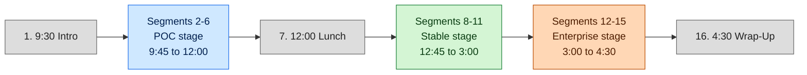

# Workshop Outline — Cloud CI/CD with GitHub Actions

## Stage banner

This is the master spine for a one-day, 16-segment Frontend Masters workshop. The workshop teaches CI/CD by progressively building a GitHub Actions pipeline for a trivial Astro static site (sample-app spec: TDD §4) through three maturity stages:

- **POC** (segments 2–6): a single workflow that deploys to S3 on push to `main`. Long-lived IAM credentials, no review, no caching. The "before" picture.
- **Stable** (segments 8–11): two workflows (CI on pull requests, deploy on merge). Caching, marketplace actions, a composite action, and a reusable workflow. PRs gate `main`.
- **Enterprise** (segments 12–15): OIDC replaces access keys. A `production` environment with reviewers gates the deploy. Actions are pinned to commit SHAs. Concurrency is configured. CloudFront with Origin Access Control fronts S3.

Three segments are interludes (no stage): Introduction (1), Lunch (7), Wrap-Up (16).

By Wrap-Up, students have observed the same `dist/` artifact ride three pipelines and can articulate which pipeline is appropriate for which operating context.

## Design choices owned by this outline

The TDD defers two decisions to the OUTLINE author. The choices below are binding for this workshop; STABLE.md and ENTERPRISE.md are written against them.

### CloudFront placement: introduce in Enterprise (TDD §6.2 default)

CloudFront is introduced in segment 13 (OIDC & Cloud Authorization), alongside the move from public-read S3 to private-with-OAC. Rationale:

- Stable's pedagogical theme is workflow-code reuse and contributor flow. Segments 8–11 already carry caching, marketplace actions, composite extraction, reusable workflows, and a comparison segment. Adding CloudFront would compete for time and dilute the theme.
- CloudFront, OAC, and OIDC tell a single coherent story: "minimize exposed surface." Pairing them in Enterprise reinforces the maturity narrative.
- Stable's deploy target is a public-read bucket (TDD §5.2). Marking this as a known weakness at end-of-Stable sets up Enterprise's "make it safe to operate" framing.

### Staging environment: not introduced (TDD §11.2 default)

The workshop demonstrates a single `production` environment. Multi-environment promotion is discussed conceptually in segment 12 talking points but not live-built. Rationale:

- Segment 12 has 30 minutes for "Environments & Protection Rules." Live-building two environments plus a promotion path would blow the time budget; segment 12 already includes environment creation, reviewer configuration, and wiring it into the deploy job.
- Promotion-from-staging is a meaningful concept students should know exists; covering it in talking points without live-building it is the right trade for a 30-minute segment.
- Adds zero load on the AWS topology (still one S3 bucket, one CloudFront distribution).

ENTERPRISE.md authors: do not introduce a staging environment in segment 12's Live build. If a student asks, the answer is "in production you would add a `staging` environment with the same shape; we are skipping it to stay in budget."

## Branch reference

Each stage's completed reference solution lives on a corresponding branch in this repository. Students who fall behind, want to compare against a known-good end-state, or are reading along after the workshop can check out the branch to see the end-of-stage repository state byte-for-byte.

| Stage | Branch | What's on the branch |
| --- | --- | --- |
| POC | `poc` | Sample app + `.github/workflows/deploy.yml` (end-of-segment-6 state) |
| Stable | `stable` | POC content + `.github/actions/build-astro/` composite + `.github/workflows/_build.yml` + `.github/workflows/ci.yml` + modified `deploy.yml` |
| Enterprise | `enterprise` | Stable content + OIDC trust + SHA-pinned actions + `production` environment + concurrency blocks + CloudFront with OAC |

The branches are linearly related: `poc` is branched from `main`, `stable` from `poc`, `enterprise` from `stable`. As a result, `git diff stable..poc` shows the diff Stable adds on top of POC, and `git diff enterprise..stable` shows the diff Enterprise adds on top of Stable.

For per-stage AWS prerequisites and GitHub settings the instructor must set up by hand before running that stage's workflows, see `README.md` on each branch.

## Day shape

## Pre-flight checklist

The instructor verifies every item below before the workshop starts. The recommended cutoff is 30 minutes before segment 1.

### Show-stoppers (verify first)

- [ ] **Workshop repository is PUBLIC.** The workshop reference repo and any student follow-along repos are PUBLIC on GitHub. Verify with `gh repo view <owner>/<repo> --json visibility -q .visibility` — must return `"PUBLIC"`. Why it matters: GitHub Environments + Required Reviewers + Wait Timers (segment 12) are free on public repos but require a paid plan for private repos. The workshop is built to run on the Free plan; a private repo silently breaks segment 12's protection-rules demo.
- [ ] **`package-lock.json` is committed in the sample-app repo.** The sample app's `package-lock.json` is committed alongside `package.json`. Verify with `git ls-files | grep package-lock.json` in the sample-app's repo — must return the file. Why it matters: `npm ci` (segment 5 onward) and `setup-node` with `cache: 'npm'` (segment 8) both REQUIRE the lockfile. Without it, segment 5's first build fails before any teaching content lands.

### Sample app

- [ ] The sample app builds locally with `npm install && npm run build` and produces a non-empty `dist/index.html`. Spec: TDD §4.
- [ ] The sample app is committed to a clean GitHub repository on `main` only. No prior `.github/workflows/` content. The instructor will commit `deploy.yml` live in segment 2.
- [ ] Node 22.22 is installed locally and matches the `package.json` `engines.node` value (`>=22.22.0`); this is the version `setup-node` pins in every workflow example.

### AWS

- [ ] An AWS account is reachable from the instructor's laptop (`aws sts get-caller-identity` returns a result).
- [ ] An S3 bucket named per the demo convention exists (`<example-bucket>` placeholder in the docs). Static website hosting is enabled. Bucket-policy starting state is public-read for POC.
- [ ] An IAM user with programmatic access exists, scoped to `s3:PutObject`, `s3:DeleteObject`, `s3:ListBucket` on the bucket. Access key ID and secret access key are ready to paste into GitHub repository secrets in segment 5 or 6.
- [ ] An IAM role for OIDC is pre-created (trust policy targets `token.actions.githubusercontent.com` with the repo and `production` environment in the `sub` condition; permission policy mirrors the IAM user plus `cloudfront:CreateInvalidation`). Role ARN is copied to a notes pane for use in segment 13. Trust-policy shape: TDD §6.4.
- [ ] A CloudFront distribution exists with the S3 bucket as origin via OAC. It is in `Disabled` state until segment 13 enables it. This avoids waiting on distribution creation live.
- [ ] AWS access keys for the IAM user are rotated to demo-only credentials. The instructor assumes the screenshare recording is permanent (TDD §11.1 risk: student commits real credentials).

### GitHub

- [ ] A workshop repository is created on GitHub under the demo owner. The instructor has admin rights for branch protection, environment, and OIDC trust setup later in the day.
- [ ] Repository secrets are empty going into segment 2. `AWS_ACCESS_KEY_ID` and `AWS_SECRET_ACCESS_KEY` will be added during segment 5 or 6 as part of the live demonstration.
- [ ] A "finished-state" branch exists for each stage (`poc`, `stable`, `enterprise`) holding the workflow files at the end of that stage. These are the failover targets if a live demo runs over time or a step fails. TDD §15.1 backup plan.

### Local environment and screenshare

- [ ] Editor font size is at or above 18pt for screenshare legibility.
- [ ] Terminal contrast is high; cursor is visible.
- [ ] Browser zoom is at 125% or higher for the GitHub web UI tour.
- [ ] Screenshare is verified end-to-end in the actual workshop tool (FEM platform, Zoom, etc.). Workshop wifi is verified to reach `github.com` and `s3.amazonaws.com`.
- [ ] Mobile-hotspot fallback is configured and tested (TDD §15.2). The instructor knows how to switch the laptop's network in under 60 seconds.

### Failure-mode preparation

- [ ] Pre-recorded screenshots of green workflow runs at each stage's end-state are saved locally. If a live demo fails, the instructor walks through the screenshot rather than debugging on stage. TDD §15.2.
- [ ] A printed copy (or second-screen view) of this OUTLINE.md is available for reference.

## Segment index

The agenda below covers all 16 FEM segments. Stage-tagged segments link to the matching H2 in the corresponding stage doc using the anchor convention `<stage>.md#segment-N--HHMM--segment-title` (TDD §9.2). Forward links resolve once Phase 2 issues complete.

---

### Segment 1 — 9:30 — Introduction

**Stage:** Interlude.

The instructor opens with the workshop's promise: at 4:30 students will have watched a single `dist/` artifact ride three increasingly mature pipelines. The instructor reveals the sample app (TDD §4) and walks the day-shape diagram above. The three-stage progression (POC → Stable → Enterprise) is named explicitly so students hear the framing before any GitHub Actions syntax appears. No code is written.

**Time-budget warning:** The Introduction is 15 minutes. Resist the temptation to summarize all of GitHub Actions here; segment 2 is when concepts start landing. If the diagram and stage names take more than 8 minutes, cut a slide and move on.

---

### Segment 2 — 9:45 — Your First Workflow

**Stage:** POC.

The first commit of `.github/workflows/deploy.yml`. The instructor types a minimal workflow with a single `runs-on: ubuntu-latest` job and a single `echo` step, pushes to `main`, and watches it run in the Actions tab. This segment is intentionally light on syntax — the goal is "students see a workflow run end-to-end before any concept is named." Talking points cover what a workflow file is, where it lives, and how GitHub knows to run it.

[Segment 2 detail →](POC.md#segment-2--945--your-first-workflow)

---

### Segment 3 — 10:00 — Triggers & Runners

**Stage:** POC.

The `on:` keyword is expanded from "the workflow runs sometimes" to "the workflow runs in response to specific repository events." The instructor demonstrates `push`, `pull_request`, and `workflow_dispatch` (the manual trigger). `runs-on:` is shown with `ubuntu-latest`, a brief mention of `windows-latest` and `macos-latest`, and a note that self-hosted runners exist (deferred to segment 15 for substance). No deploy yet.

[Segment 3 detail →](POC.md#segment-3--1000--triggers--runners)

---

### Segment 4 — 10:30 — Contexts & Expressions

**Stage:** POC.

Students learn `${{ ... }}` syntax and the `github` context. The instructor reads `github.actor`, `github.ref`, `github.event_name`, and demonstrates `if:` on a step (e.g., `if: github.ref == 'refs/heads/main'`). Expressions are framed as "the only place workflow files have logic" — by segment 4 students should know that everything else in YAML is declarative.

[Segment 4 detail →](POC.md#segment-4--1030--contexts--expressions)

---

### Segment 5 — 11:00 — Building a CI Pipeline

**Stage:** POC.

The first real pipeline. The instructor adds `actions/checkout@v4`, `actions/setup-node@v4`, and runs `npm ci && npm run build`. The Actions log shows Astro producing `dist/`. AWS credentials enter the picture: the instructor pastes the IAM user's access key into repo secrets and adds a final `aws s3 sync dist/ s3://<example-bucket>/` step. Push to `main`, observe the deploy in S3.

**Time-budget warning:** 30 minutes is tight for "first build + first deploy." Pre-stage everything that does not teach a concept: the IAM user, the S3 bucket, and the bucket policy must already exist. Only the GitHub secret paste and the workflow edit happen live.

[Segment 5 detail →](POC.md#segment-5--1100--building-a-ci-pipeline)

---

### Segment 6 — 11:30 — Job Dependencies & Artifacts

**Stage:** POC. End of POC stage.

The single job from segment 5 is split into `build` and `deploy` jobs. `actions/upload-artifact@v4` and `actions/download-artifact@v4` move `dist/` between them. `needs: build` wires the order. This is the segment that justifies why CI/CD has the word "dependencies" in it: the deploy job cannot start until the build job finishes and emits the artifact.

The end-of-POC recap closes the stage: a working pipeline that deploys on every push, with no review, no caching, and credentials in plaintext. The instructor names these as the four problems Stable will solve.

[Segment 6 detail →](POC.md#segment-6--1130--job-dependencies--artifacts)

---

### Segment 7 — 12:00 — Lunch

**Stage:** Interlude.

No teaching content. Students return at 12:45.

The instructor uses the break to (1) verify the segment-8 demo (caching) is staged, (2) confirm the `poc` branch matches what was just built, and (3) drink water.

---

### Segment 8 — 12:45 — Caching & Debugging Workflows

**Stage:** Stable.

The first afternoon segment introduces caching (`actions/cache` keyed on `package-lock.json` hash) and the idiomatic alternative (`actions/setup-node` with `cache: 'npm'`). The instructor demonstrates both, then deliberately breaks the workflow (mistypes a cache key) and walks through the failure: re-run with debug logging via `ACTIONS_STEP_DEBUG`. The deliberate-failure step is required by TDD §11.2 Q4 and lives in this segment, not earlier.

**Time-budget warning:** The deliberate-failure demo can spiral. Budget 5 minutes for the failure and recovery; if it goes over 8, switch to the pre-recorded screenshot.

[Segment 8 detail →](STABLE.md#segment-8--1245--caching--debugging-workflows)

---

### Segment 9 — 1:15 — Marketplace & Composite Actions

**Stage:** Stable.

The instructor browses the GitHub Marketplace, names what to look for in a marketplace action (publisher, recent commits, star count, security advisories), and pulls in a representative one. Then the workshop's first composite action: `.github/actions/build-astro/action.yml` extracts the checkout → setup-node → install → build sequence. The composite is consumed by the deploy workflow on the next push.

[Segment 9 detail →](STABLE.md#segment-9--115--marketplace--composite-actions)

---

### Segment 10 — 2:00 — Reusable Workflows

**Stage:** Stable.

The same build sequence is now extracted a second way: `.github/workflows/_build.yml` with `on: workflow_call`. The instructor adds a `ci.yml` triggered on `pull_request` that calls `_build.yml`, and updates `deploy.yml` to call `_build.yml` for the build phase. After this segment, a feature branch with a PR shows CI running; merging to `main` triggers deploy. Branch protection on `main` is configured live so the required check is enforced.

[Segment 10 detail →](STABLE.md#segment-10--200--reusable-workflows)

---

### Segment 11 — 2:35 — Composite vs. Reusable vs. Custom

**Stage:** Stable. End of Stable stage.

A comparison segment. No new code. The instructor walks a comparison table covering: scope of reuse (within a repo vs. across repos), input/output shape (`inputs:`/`outputs:` blocks), where each is best used (composite for inline step sequences, reusable for whole jobs, custom JavaScript/Docker actions for novel logic). Students leave segment 11 able to choose the right reuse mechanism for a given problem.

The end-of-Stable recap closes the stage: PR-gated deploys, fast builds via cache, DRY workflow code. The instructor names what is still wrong: long-lived AWS credentials, no environment-level approval, third-party actions pinned to mutable major-version tags, no concurrency control. Enterprise will solve all four.

**Time-budget warning:** Segment 11 is 25 minutes — the shortest substantive segment of the day. Keep the comparison table tight. If discussion runs long, the comparison is the better cut than the end-of-stage recap; the recap is what sets up Enterprise.

[Segment 11 detail →](STABLE.md#segment-11--235--composite-vs-reusable-vs-custom)

---

### Segment 12 — 3:00 — Environments & Protection Rules

**Stage:** Enterprise.

The instructor creates a `production` environment in the GitHub repository settings, configures required reviewers (the instructor self-approves for the demo), and sets a wait timer (e.g., 1 minute, kept short for live demo). The deploy job in `deploy.yml` declares `environment: production`. On the next push to `main`, the deploy job pauses awaiting approval. The instructor approves and the deploy proceeds.

This is also where multi-environment promotion is discussed conceptually (see "Design choices owned by this outline" — staging is not introduced live).

[Segment 12 detail →](ENTERPRISE.md#segment-12--300--environments--protection-rules)

---

### Segment 13 — 3:30 — OIDC & Cloud Authorization

**Stage:** Enterprise.

The keystone Enterprise segment. Long-lived AWS access keys are removed from GitHub secrets. The instructor walks the IAM trust policy targeting `token.actions.githubusercontent.com` with a `sub` condition binding the role to the workshop repository's `production` environment (TDD §6.4). `aws-actions/configure-aws-credentials@v4` is reconfigured with `role-to-assume: <role-arn>` and `aws-region`. The job grows a `permissions:` block: `id-token: write, contents: read`.

CloudFront enters here (per design choice above): the pre-staged distribution is enabled, S3 bucket policy is flipped from public-read to OAC-only, and a `cloudfront:CreateInvalidation` step is added to the deploy job to bust the CDN cache after sync.

**Time-budget warning:** This segment will run long. OIDC has the most moving parts of any Enterprise concept (IAM trust policy + AWS provider + workflow `permissions` + provider action config). Budget the full 30 minutes. If CloudFront enablement starts to drag, the OIDC switch is the priority — the bucket-policy + CloudFront enable can be skipped on stage and shown via screenshot. The OIDC token exchange is the demo students paid for.

[Segment 13 detail →](ENTERPRISE.md#segment-13--330--oidc--cloud-authorization)

---

### Segment 14 — 4:00 — Hardening Your Workflows

**Stage:** Enterprise.

Two changes. First, every third-party action is repinned from a major-version tag to a full 40-character commit SHA, with a trailing comment naming the version (e.g., `actions/checkout@<40-char-sha> # v4.1.7`). Second, the workflow-level `permissions:` block is set to deny-all by default and each job grants only what it needs (`id-token: write` only on the deploy job; `contents: read` everywhere). The instructor frames both as concrete responses to OWASP CI/CD-SEC-3 (third-party action integrity) and CICD-SEC-1 (least privilege).

[Segment 14 detail →](ENTERPRISE.md#segment-14--400--hardening-your-workflows)

---

### Segment 15 — 4:15 — Concurrency & Self-Hosted Runners

**Stage:** Enterprise. End of Enterprise stage.

A `concurrency:` block is added to both workflows. CI on PRs uses `group: ci-${{ github.event.pull_request.number }}`, `cancel-in-progress: true` — old runs are cancelled when a new commit lands on the PR. The deploy workflow uses `group: production-deploy`, `cancel-in-progress: false` — production deploys queue rather than cancel.

Self-hosted runners are then introduced as a discussion-only topic: when they make sense (VPC-internal deploys, custom hardware, license-bound tooling), what they cost operationally (you own the patching, the autoscaling, and the credential exposure surface), and why this workshop does not run one live. The TDD explicitly forbids a live self-hosted runner setup at this segment.

The end-of-Enterprise recap closes the workshop's technical content: OIDC removed long-lived credentials, `production` environment gates the deploy, SHA-pinning fixes third-party action drift, concurrency controls prevent races. The pipeline is now reviewable.

**Time-budget warning:** Self-hosted runners are a tar pit. The TDD §11.1 risk is "30-minute tangent" — segment 15 is only 15 minutes. Budget 4 minutes for self-hosted discussion, max. If a student wants more, defer to office hours or the FEM platform comments.

[Segment 15 detail →](ENTERPRISE.md#segment-15--415--concurrency--self-hosted-runners)

---

### Segment 16 — 4:30 — Wrap-Up

**Stage:** Interlude.

The instructor recaps the three stages by replaying the day-shape diagram. The same `dist/` artifact rode three pipelines; the diff between pipelines is the entire workshop. Students are pointed at:

- The GitHub Actions documentation for syntax reference.
- The OWASP CI/CD Top 10 for the security framing introduced in Enterprise.
- The AWS Well-Architected Framework for the maturity-progression framing.
- The repository structure described in TDD §8 for what the end-state of each stage looks like.

No new content. The goal is to leave students with a mental model they can apply to their own pipelines on Monday.

---

## Cross-doc references

- TDD source of truth: [`../tdd/fem-cicd-workshop-architecture.md`](../tdd/fem-cicd-workshop-architecture.md)
- POC stage detail: [`POC.md`](POC.md) (Phase 2a)
- Stable stage detail: [`STABLE.md`](STABLE.md) (Phase 2b)
- Enterprise stage detail: [`ENTERPRISE.md`](ENTERPRISE.md) (Phase 2c)

## See also

- TDD §2 — FEM 16-segment agenda
- TDD §4 — Sample-app specification
- TDD §5 — Three-stage architecture detail
- TDD §6 — AWS topology and CloudFront placement decision
- TDD §7 — Canonical FEM-segment to stage mapping
- TDD §9 — Instructor doc conventions
- TDD §10 — Diagrams (day-shape, pipeline-by-stage, state transitions)
- TDD §11 — Risks and resolved open questions
- TDD §15 — Pre-workshop checklist and failure-mode plans
