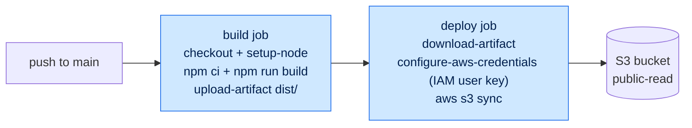

# POC Stage — Make it Deploy

## Stage banner

POC stage, FEM segments 2–6. By 12:00, students have a single workflow file (`.github/workflows/deploy.yml`) that builds the sample app and ships `dist/` to an S3 bucket on every push to `main`. Authentication is a long-lived IAM-user access key pasted into GitHub repository secrets. There is no PR gate, no caching, no concurrency control, and no environment approval. This is the "before" picture: a pipeline a student could have shipped in 2014. Stable and Enterprise are the diff.

## Completed reference

The completed end-of-segment-6 state described in this doc — the sample-app files (TDD §4) plus `.github/workflows/deploy.yml` — lives byte-for-byte on the `poc` branch. A senior-engineer or student who wants to see the finished pipeline without walking the segments can check out that branch and run it.

For the AWS prerequisites and GitHub repository settings the instructor configures before this stage runs live, see `README.md` on the `poc` branch.

The YAML excerpt at lines 199–239 of this doc IS the file committed on the `poc` branch (modulo `<example-bucket>` and region placeholders).

## Pre-flight

The OUTLINE pre-flight checklist (`OUTLINE.md` → "Pre-flight checklist") is the source of truth. The items below are the subset that must be verified before segment 2 starts and are POC-stage-specific:

- The sample app (TDD §4) is committed to a clean GitHub repository. `main` is the only branch. No `.github/workflows/` directory exists yet — segment 2 creates it live.
- An S3 bucket per the demo convention exists with static website hosting enabled and a public-read bucket policy (TDD §6.3, POC row).
- An IAM user with programmatic access exists, scoped to `s3:PutObject`, `s3:DeleteObject`, `s3:ListBucket` on the bucket. The access key ID and secret access key are in a paste-buffer the instructor can reach in segment 5 — and rotated to demo-only credentials, because the screenshare recording is permanent (TDD §11.1).
- GitHub repository secrets are empty. `AWS_ACCESS_KEY_ID` and `AWS_SECRET_ACCESS_KEY` are added live during segment 5.
- The `poc` branch exists with the end-of-segment-6 `deploy.yml` already committed. This is the failover target if a live demo runs over time.
- The instructor's editor font is at or above 18pt and the GitHub web UI is at 125% zoom or higher (TDD §15.1, also enforced in OUTLINE pre-flight).

If any item above is missing, do not start segment 2. Recover during segment 1's 15-minute Introduction window.

## Segment 2 — 9:45 — Your First Workflow

### Talking points

- A workflow is a YAML file in `.github/workflows/`. GitHub watches that directory and runs anything it finds whose `on:` clause matches a repository event.
- The workflow file is just code in the repo. It is versioned, reviewed, and shipped exactly like the application code next to it. There is no separate CI server to configure.
- A workflow has one or more **jobs**. A job runs on a **runner** (a virtual machine GitHub allocates for the run). A job has one or more **steps**, which run sequentially on that runner.
- The smallest possible workflow is a single job with a single `echo` step. The goal of segment 2 is to see one run end-to-end before any concept is named in depth — names land in segments 3 and 4.

### Live build

1. In the repo, create `.github/workflows/deploy.yml`. Type the directory path on screen so students see where the file goes.
2. Type the minimum workflow:
   - `name: Deploy`
   - `on: push` (no branch filter yet — that is segment 3's lesson)
   - one job named `deploy` with `runs-on: ubuntu-latest`
   - one step: `run: echo "Hello from a workflow"`
3. Commit and push to `main` from the local clone. (Pre-staged: the local clone is already authenticated to push.)
4. Open the GitHub web UI, navigate to the **Actions** tab. Click into the running workflow. Show the logs streaming in. Wait for the green check.
5. Click into the `deploy` job, expand the `echo` step, read the logged output aloud.

### Common questions / Gotchas

- **Q: Why does the file have to be in `.github/workflows/`?** Because that is the only directory GitHub Actions reads. A YAML file in any other directory is ignored. This is convention, not configuration.
- **Q: Can I have more than one workflow file?** Yes. Each file in `.github/workflows/` is a separate, independent workflow. Stable will use two; we use one in POC.
- **Q: What does `ubuntu-latest` actually mean?** A GitHub-managed Ubuntu virtual machine with a curated toolchain pre-installed. Concrete tooling list is segment 3.
- **Gotcha (instructor):** YAML indentation errors are the most common cause of "my workflow doesn't run." If the workflow does not appear in the Actions tab at all, suspect indentation before suspecting GitHub. Have a known-good copy in the `poc` branch's history to diff against.
- **Gotcha (instructor):** Resist explaining `on: push` deeply here. Segment 3 is 15 minutes from now and is dedicated to triggers. If a student asks, say "we will name that next segment" and move on.

### Transition

We have a workflow that runs on every push but does not yet do anything useful. Segment 3 narrows `on:` so we can choose **when** the workflow runs, then introduces `runs-on:` so we know **where** it runs.

## Segment 3 — 10:00 — Triggers & Runners

### Talking points

- The `on:` keyword answers "when does this workflow run?" Common values: `push` (any push to any branch), `pull_request` (a PR is opened, synchronized, or reopened), `workflow_dispatch` (a human clicks "Run workflow" in the UI), `schedule` (cron), and several repository events (`issues`, `release`, etc.).
- `on:` accepts filters. `push: branches: [main]` runs only on pushes to `main`. `pull_request: paths: ['src/**']` runs only when files under `src/` change in a PR. Filters compose: branch + path on the same event.
- `runs-on:` answers "where does this job run?" GitHub-hosted runners include `ubuntu-latest`, `windows-latest`, and `macos-latest`. Each is a fresh VM per job — no state survives between jobs.
- Self-hosted runners exist. They are runners you operate, registered with GitHub. We do not use one in this workshop; segment 15 covers when they are appropriate.

### Live build

1. Open `deploy.yml` in the editor.
2. Narrow the trigger from `on: push` to:
   - `on: push: branches: [main]`
3. Add a second trigger to demonstrate composition: `workflow_dispatch:` (no inputs).
4. Commit and push. In the GitHub Actions tab, observe that the workflow ran on the push to `main`.
5. From the Actions tab, click **Run workflow** on the deploy workflow. Demonstrate the manual trigger; observe the second run.
6. Briefly point at the `runs-on: ubuntu-latest` line and read the runner type from the run log header (where GitHub prints "Runner Image: Ubuntu …"). Do not pivot into Windows or macOS examples — call them out as available and move on.

### Common questions / Gotchas

- **Q: What happens if I push to a branch other than `main` now?** Nothing. The branch filter excludes other branches. We will revisit this in Stable when `pull_request` is added.
- **Q: Are `ubuntu-latest` images pinned?** GitHub rolls `*-latest` forward periodically. For reproducibility in production, pin a version like `ubuntu-22.04`. The workshop uses `*-latest` for brevity.
- **Q: Can I trigger a workflow from an external system?** Yes — `repository_dispatch` (API call to GitHub) and `workflow_call` (called by another workflow). `workflow_call` is the topic of Stable's segment 10.
- **Gotcha (instructor):** Do not enumerate every event in the `on:` documentation. Students will glaze over. Stick to the four named in the talking points.
- **Gotcha (instructor):** `workflow_dispatch:` requires the workflow file to already be on the default branch before the **Run workflow** button appears. If you added it on a feature branch, the button will not show until the workflow lands on `main`. We are committing directly to `main` in POC, so this is moot — but it bites students who later try this in a fork.

### Transition

We can run the workflow on `push` to `main` or by manual dispatch. The workflow still only echoes a string. Segment 4 introduces expressions and contexts so the workflow can read information about the event that triggered it — actor, ref, event name — and act on that information.

## Segment 4 — 10:30 — Contexts & Expressions

### Talking points

- `${{ ... }}` is GitHub Actions' expression syntax. It is the only place a workflow file has logic. Outside of `${{ }}`, the YAML is purely declarative.
- A **context** is a structured object you can read inside `${{ }}`. The most-used contexts in this workshop are `github` (the event, the repo, the actor, the ref), `runner` (OS, temp dir), `env` (env vars), `secrets` (encrypted secret values), and `vars` (repo-level variables).
- The `if:` keyword on a step or job runs that step or job only when the expression evaluates to `true`. Example: `if: github.ref == 'refs/heads/main'` skips the step on any branch other than `main`.
- Expressions are not a general programming language. They support equality, boolean operators, a small set of built-in functions (`contains`, `startsWith`, `success()`, `failure()`, `always()`), and that is the bulk of it. If a workflow needs more logic than that, the answer is a script in a `run:` step, not more `${{ }}`.

### Live build

1. Open `deploy.yml`. Add a step named `Show context` with a `run:` that echoes three values:
   - `${{ github.actor }}`
   - `${{ github.ref }}`
   - `${{ github.event_name }}`
2. Commit and push. Open the run log; read the three values aloud. Show that `github.event_name` reads `push` here, and would read `workflow_dispatch` if you ran it via the manual trigger.
3. Trigger the workflow manually (Run workflow button). Observe `github.event_name` is now `workflow_dispatch`.
4. Add an `if:` to a new step that only runs on pushes to `main`:
   - Step name: `Only on main push`
   - `if: github.event_name == 'push' && github.ref == 'refs/heads/main'`
   - `run: echo "This only runs on push to main"`
5. Push a commit. The step runs. Trigger via Run workflow; the step is skipped (shown as a grey skipped status in the UI). Click into the run and show the skipped step.
6. Remove the demonstration steps before moving to segment 5 — leave `deploy.yml` clean for the build pipeline. (Or comment them out and announce the cleanup; either is fine, but do not leave debug echoes in the segment-6 final.)

### Common questions / Gotchas

- **Q: How do I see the full `github` context?** A common pattern: `run: echo '${{ toJSON(github) }}'`. Demonstrate it once if time allows; the JSON dump is large.
- **Q: Can I reference `secrets` in `if:`?** No — `if:` cannot read `secrets` for security reasons (it would let an attacker exfiltrate via the conditional). Use `env:` to project a secret into a step's environment instead.
- **Q: What is the difference between `github.ref` and `github.head_ref`?** `github.ref` is the ref that triggered the workflow (`refs/heads/main` for a push, `refs/pull/<n>/merge` for a `pull_request`). `github.head_ref` is the source branch on a PR. Defer the deep version to Stable's segment 8.
- **Gotcha (instructor):** Do not introduce `needs.<job>.outputs` here. Job outputs require dependent jobs, which is segment 6's lesson. If a student asks, say "we will use that next segment."
- **Gotcha (instructor):** YAML's parser sees `if: ${{ ... }}` and the equivalent `if: ...` (no braces) as the same on top-level keys. The braces are optional on `if:` but mandatory inside string interpolation. Show the brace form consistently to avoid teaching two syntaxes.

### Transition

We can read the event and gate steps on it. The workflow is still a single `echo`. Segment 5 turns it into a real CI pipeline: checkout the repo, install Node, build the sample app, and ship `dist/` to S3.

## Segment 5 — 11:00 — Building a CI Pipeline

### Talking points

- A useful CI pipeline starts with three steps every Node project needs: check out the repo (`actions/checkout`), install a Node toolchain (`actions/setup-node`), and run the install + build commands. We add the AWS upload last.
- An **action** is a reusable unit of work. `actions/checkout@v4` is a first-party action that clones the repo into the runner's working directory. `actions/setup-node@v4` installs a specified Node version. Both are the canonical entry points for any JavaScript project on Actions.
- AWS authentication in POC is the simplest thing that works: an IAM user with programmatic access, key pair stored in GitHub repository secrets, consumed by the `aws-actions/configure-aws-credentials@v4` action. This is **wrong** for production — segment 13 fixes it with OIDC. We are doing it the wrong way on purpose, to make the right way concrete later.
- The build is the test. The sample app has no Vitest, no ESLint, no Prettier (TDD §4.9). For a static site, "the TypeScript compiles and Astro produces a `dist/`" is the green-pipeline signal.
- We are about to add the AWS access key to repo secrets on stage. This is the highest-risk action of the day for the screenshare recording. The Gotcha section below covers mitigations; pause and read it before doing the live paste.

### Live build

> Time-budget warning: 30 minutes is tight for "first build + first deploy." The IAM user, the bucket, and the bucket policy are pre-staged (see Pre-flight). Only the GitHub secret paste and the workflow edit happen on screen.

1. Open `deploy.yml`. Replace the segment-2/3/4 demonstration steps with a real pipeline. Keep `name: Deploy`, `on: push: branches: [main]`, and `runs-on: ubuntu-latest`. The single job is still named `deploy`.
2. First step: `uses: actions/checkout@v4`. Narrate that this clones the repo into the runner. No `with:` needed for the default behavior.
3. Second step: `uses: actions/setup-node@v4` with `with: node-version: 22.22` (pinned to Node 22.22 so the runner matches `package.json` `engines.node` of `>=22.22.0` from pre-flight, TDD §4.2; no surprise version drift between workshop dates).
4. Third step: `run: npm ci`. Narrate the difference from `npm install`: `npm ci` requires `package-lock.json` and produces a deterministic install — exactly the property CI wants.
5. Fourth step: `run: npm run build`. The Astro build emits `dist/` (TDD §4.8). Push, watch the run, click into the **Build** step, scroll to where Astro reports `dist/index.html` was written.
6. Now AWS. In a separate browser tab, open the repo's **Settings → Secrets and variables → Actions**. Create two repository secrets:
   - `AWS_ACCESS_KEY_ID` — paste the IAM user's access key ID.
   - `AWS_SECRET_ACCESS_KEY` — paste the secret.
   - **Critical:** narrate the warning while you do this. Do not display the values; GitHub redacts them in the UI but the screenshare recording is permanent (see Gotchas below).
7. Back in `deploy.yml`, add a fifth step using `aws-actions/configure-aws-credentials@v4` with `with:` keys `aws-access-key-id: ${{ secrets.AWS_ACCESS_KEY_ID }}`, `aws-secret-access-key: ${{ secrets.AWS_SECRET_ACCESS_KEY }}`, `aws-region: <region>`.
8. Add a sixth step: `run: aws s3 sync dist/ s3://<example-bucket>/ --delete`. The `--delete` mirrors `dist/` exactly; deleted files in `dist/` are removed from the bucket.
9. Commit, push. Watch the run. When it goes green, open the bucket's static-website URL in a new tab. The "Hello, world" page renders. (If the bucket URL is not memorized, paste it from a notes pane — do not type the bucket name from memory live.)

### Common questions / Gotchas

- **Q: Why `npm ci` instead of `npm install`?** `npm ci` reads `package-lock.json` exactly and fails if the lock and `package.json` disagree. It also wipes `node_modules` first. Both properties are what CI wants — deterministic, repeatable installs.
- **Q: Where do I get the IAM user's access key from?** In the workshop, it is pre-created (see Pre-flight). In production, you create an IAM user, grant least-privilege S3 actions, generate an access key, and immediately store it somewhere safe — because AWS will only show the secret once.
- **Q: Why do we use `s3 sync` rather than `s3 cp`?** `sync` only uploads files that changed. For a tiny app this is irrelevant; for a real site, it cuts deploy time and S3 PUT charges meaningfully.
- **Q: Is this safe?** No. The IAM user's access key in GitHub secrets is the single biggest weakness of the POC pipeline. Anyone with write access to the repo can exfiltrate it via a workflow change. Enterprise (segment 13) replaces it with OIDC.
- **Gotcha (instructor) — AWS credentials on screen:** When pasting the access key into the GitHub secrets UI, the field is masked but the **clipboard** is not. If you Cmd+V into the secret field with the key visible in a clipboard manager, terminal scrollback, or password-manager popup, the recording captures it permanently. Mitigations: (1) use demo-only rotated credentials specifically for this workshop (TDD §11.1); (2) close clipboard managers and password manager auto-fill before this step; (3) paste from a non-screenshared window if your setup permits. Treat the screenshare as if it will be on YouTube forever — because it will be.
- **Gotcha (instructor):** If `aws s3 sync` fails with `AccessDenied`, the IAM user is missing `s3:ListBucket` (sync needs to enumerate). Add `s3:ListBucket` to the user's policy on the bucket, not on `*`. This is a common pre-flight oversight.
- **Gotcha (instructor):** Do not use `aws s3 cp --recursive` here as a "simpler" alternative. It does not delete removed files and will diverge from `dist/` over redeploys. The deletion semantics matter.

### Transition

We have a working deploy: push to `main`, the workflow checks out, builds, and ships `dist/` to S3. Everything is in one job. Segment 6 splits it into a `build` job and a `deploy` job, with an artifact handoff between them. That is the segment that justifies why CI/CD has the word "dependencies" in its name.

## Segment 6 — 11:30 — Job Dependencies & Artifacts

### Talking points

- Real pipelines split build from deploy. The build is what produces the artifact you are confident in. The deploy is what ships that exact artifact. Splitting them lets you reuse the build artifact (preview environments, multiple targets) and run deploys without rebuilding.
- Each job runs on a fresh runner. There is no shared filesystem between jobs. To move files from one job to another, you upload an artifact from job A and download it in job B.
- `actions/upload-artifact@v4` and `actions/download-artifact@v4` are the canonical pair. The artifact is named, retained for a configurable window (default 90 days), and downloadable from the run UI.
- `needs:` declares job dependencies. `deploy: needs: build` means "do not start the deploy job until the build job has completed successfully." A failed `build` short-circuits — `deploy` never runs.
- Job ordering is not free. Splitting adds runner-startup overhead twice. For a 30-second build it costs 20–30 seconds. The trade is worth it because the artifact becomes a first-class object you can inspect, redeploy, or attach to a release.

### Live build

> *Time budget: 30 min, hard cap. Lunch at 12:00 — if anything slips, drop step 10 (the optional rerun-deploy demo) before pushing past the bell.*

1. Open `deploy.yml`. The single job from segment 5 becomes two jobs.
2. Rename the existing job from `deploy` to `build`. Remove the AWS-credentials step and the `aws s3 sync` step from `build` — those move to the new `deploy` job.
3. After `npm run build` in the `build` job, add a final step: `uses: actions/upload-artifact@v4` with `with: name: dist`, `path: dist/`. The artifact is named `dist` and its contents are the `dist/` directory.
4. Add a second top-level job, `deploy`. Set `runs-on: ubuntu-latest` and `needs: build`.
5. First step of `deploy`: `uses: actions/download-artifact@v4` with `with: name: dist`, `path: dist/`. The artifact is restored into a `dist/` directory on the new runner.
6. Second step of `deploy`: `aws-actions/configure-aws-credentials@v4` (same secrets as segment 5).
7. Third step of `deploy`: `run: aws s3 sync dist/ s3://<example-bucket>/ --delete`.
8. Commit, push. In the Actions UI, observe the dependency graph: `build` runs first, then `deploy` runs after `build` completes. The artifact appears in the run summary as a downloadable zip.
9. Click into the run summary. Show the artifact card. Click the artifact name to download `dist.zip`. Open it locally and show that `index.html` is inside — students see the deployed bytes are the same bytes the build produced.
10. (Optional, time-permitting:) Manually rerun the `deploy` job from the Actions UI without rerunning `build`. Observe the artifact is reused. This is the value of the split.

The end-of-segment-6 `deploy.yml`:

```yaml
# .github/workflows/deploy.yml — POC stage, end of segment 6
name: Deploy

on:
  push:
    branches: [main]
  workflow_dispatch:

jobs:
  build:
    runs-on: ubuntu-latest
    steps:
      - uses: actions/checkout@v4
      - uses: actions/setup-node@v4
        with:
          node-version: 22.22
      - run: npm ci
      - run: npm run build
      - uses: actions/upload-artifact@v4
        with:
          name: dist
          path: dist/

  deploy:
    runs-on: ubuntu-latest
    needs: build
    steps:
      - uses: actions/download-artifact@v4
        with:
          name: dist
          path: dist/
      - uses: aws-actions/configure-aws-credentials@v4
        with:
          aws-access-key-id: ${{ secrets.AWS_ACCESS_KEY_ID }}
          aws-secret-access-key: ${{ secrets.AWS_SECRET_ACCESS_KEY }}
          aws-region: us-east-1
      - run: aws s3 sync dist/ s3://<example-bucket>/ --delete
```

### Common questions / Gotchas

- **Q: Could the `build` and `deploy` jobs run in parallel?** Without `needs:`, yes — that is the default. We use `needs: build` to force ordering. Without it, `deploy` would attempt `download-artifact` before `build` had uploaded one, and fail.
- **Q: How long are artifacts retained?** Default 90 days, configurable per workflow or per artifact. For a workshop this is irrelevant; for a real pipeline you tune it for cost.
- **Q: What happens if `build` fails?** `deploy` is skipped (shown grey in the UI). `needs:` short-circuits on failure unless you override with `if: always()` or `if: success() || failure()` — both of which we are not using.
- **Q: Why isn't the artifact passed as an output instead of upload/download?** Outputs are scalars (strings), not files. For files you need the artifact mechanism. Outputs are useful for things like a build-determined version string passed to a deploy job.
- **Gotcha (instructor):** `actions/upload-artifact@v4` and `download-artifact@v4` are not interchangeable with `@v3`. The v4 family changed the storage backend; mixing v3 upload with v4 download (or vice versa) silently fails. Pin both to v4.
- **Gotcha (instructor) — AWS credentials still on screen:** The credentials step in `deploy` reads the same secrets pasted in segment 5. Do not re-paste the values here. If a student asks "where are these defined?", point at the Settings UI; do not open the secret.
- **Gotcha (instructor):** If you reorder steps so `aws-actions/configure-aws-credentials` runs after `aws s3 sync`, the sync fails with `Unable to locate credentials`. The credentials action sets environment variables for subsequent steps; ordering is load-bearing.

### Transition

POC is done. We have a working pipeline that builds, hands off an artifact, and deploys to S3 on every push to `main`. Take a look at the end-of-POC pipeline diagram below before lunch — that shape is what we will compare against in Stable.

After lunch (segment 8, Stable stage), we will fix the four obvious problems with this pipeline. Continue reading at [STABLE.md](STABLE.md) when ready.

## End-of-POC pipeline



## End-of-stage recap

By 12:00, students have:

- A single workflow file, `.github/workflows/deploy.yml`, with two jobs: `build` and `deploy`.
- A build job that checks out, installs Node, runs `npm ci`, runs `npm run build`, and uploads `dist/` as an artifact named `dist`.
- A deploy job that depends on `build`, downloads the `dist` artifact, configures AWS credentials from repo secrets, and runs `aws s3 sync dist/ s3://<example-bucket>/ --delete`.
- A trigger on `push: branches: [main]` plus `workflow_dispatch`.
- Two GitHub repository secrets: `AWS_ACCESS_KEY_ID` and `AWS_SECRET_ACCESS_KEY` (long-lived IAM user credentials).
- A public-read S3 bucket serving the static site.

What is still wrong with this pipeline — the four problems Stable solves:

- **Long-lived AWS credentials in GitHub secrets.** Anyone with write access to the repo (or any third-party action the workflow uses) can exfiltrate them. Stable does not fix this — Enterprise (segment 13) does, with OIDC.
- **No review gate.** Every push to `main` deploys. There is no pull request, no required check, no human approval. Stable adds a `pull_request`-triggered CI workflow and protects `main` so direct pushes are blocked.
- **No caching.** Every run installs npm dependencies from scratch. For the trivial sample app this is ~5 seconds; for a real app it is the dominant cost of every CI run. Stable adds `actions/setup-node` cache (and `actions/cache` as the alternative).
- **No concurrency control.** Two simultaneous pushes to `main` produce two concurrent deploys racing each other. The last one to finish "wins" — but the order is non-deterministic. Enterprise (segment 15) adds `concurrency:` blocks; Stable carries the gap forward.

Stable also introduces workflow-code reuse (composite actions and reusable workflows) — a separate concern from the four above, but the segment block where they fit.

## See also

- [`OUTLINE.md`](OUTLINE.md) — master spine; FEM segment list; pre-flight checklist.
- [`STABLE.md`](STABLE.md) — Stage 2 (Stable, "Make it safe to collaborate"). The next stage.
- [`../tdd/fem-cicd-workshop-architecture.md`](../tdd/fem-cicd-workshop-architecture.md) — TDD source of truth.
  - §4 — sample-app spec (do not redefine `package.json`, `astro.config.mjs`, `tsconfig.json`, or `index.astro` content; reference §4.x as needed)
  - §5.1 — POC GitHub Actions characteristics
  - §6.1, §6.3 — POC AWS topology and bucket policy
  - §7 — segment-to-stage mapping
  - §8.1 — end-of-POC repo state
  - §9 — instructor doc conventions (this doc adheres)
  - §10.2 — end-of-POC pipeline Mermaid pattern
  - §11.1 — risks (AWS-credential-on-screen, live-demo overrun)
