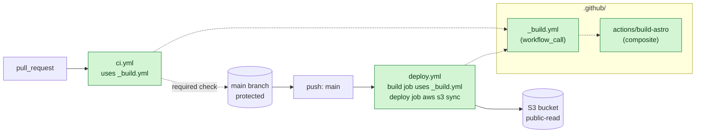

# Stable Stage — Make It Safe to Collaborate

## Stage banner

Stable stage, FEM segments 8–11. Time block: 12:45 to 3:00. By the end of segment 11, the same `dist/` artifact that the POC pipeline shipped is now produced by a multi-contributor pipeline: pull requests trigger a CI workflow that gates merges to `main`, the build sequence is extracted twice (once as a composite action, once as a reusable workflow), and the npm install is cached so successive builds finish in seconds. The deploy target and AWS credentials are unchanged from POC — Stable is a workflow-code maturity stage, not an infrastructure stage. Students leave segment 11 with a pipeline they would not be embarrassed to put in a portfolio.

## Completed reference

The end-of-Stable state described in this document — the `build-astro` composite action (lines 143–186), the `_build.yml` reusable workflow (lines 259–299), the `ci.yml` PR-validation workflow (lines 307–320), and the modified `deploy.yml` that consumes `_build.yml` with caching (lines 326–353) — lives on the `stable` branch of this repository.

The branch progression is linear: `stable` is branched from `poc`, so `git diff stable..poc` shows exactly what segments 8–11 add on top of the POC end-state. See the per-branch `README.md` on the `stable` branch for branch-protection rule configuration and the `ACTIONS_STEP_DEBUG` demo setup used in segment 8.

The `stable` branch does NOT yet include OIDC, SHA-pinning, environments, concurrency, or CloudFront — those land on the `enterprise` branch (segments 12–15) and are out of scope for this stage.

## Pre-flight

What must already be true at the start of segment 8 (12:45). Most of this is the POC end-state; the rest is staging for the deliberate-failure demo in segment 8 and the branch-protection toggle in segment 10.

- The POC pipeline from segment 6 is green on the last push to `main`. The repo's `.github/workflows/deploy.yml` matches the POC end-state in TDD §8.1 (single workflow, `build` job → `deploy` job via `needs:` and `actions/upload-artifact@v4` / `actions/download-artifact@v4`).
- `poc` branch is up to date with the POC end-state. It is the failover target if a Stable transformation breaks live.
- The instructor has a feature branch ready to push from for the segment-10 PR demo (e.g., `feature/example-pr`). The branch holds a one-line edit to `src/pages/index.astro`'s greeting so the PR has a real diff.
- Branch-protection settings for `main` are open in a browser tab but **not yet enabled**. Segment 10 turns them on live.
- A second laptop or personal GitHub account is signed in and ready to demonstrate that direct push to `main` is blocked once protection is enabled. (Optional but recommended; without it the instructor narrates the failure rather than showing it.)
- AWS credentials in repo secrets (`AWS_ACCESS_KEY_ID`, `AWS_SECRET_ACCESS_KEY`) are unchanged from POC. Stable does NOT introduce OIDC; that lives in segment 13.
- `ACTIONS_STEP_DEBUG` repo-level secret is **not** set. Segment 8 adds it live as part of the debugging demo, then can be left in place.
- Pre-recorded screenshots of (a) a green `ci.yml` PR check, (b) a successful `_build.yml` reusable invocation, and (c) the comparison-table summary slide are saved locally as failover content per TDD §15.2.

---

## Segment 8 — 12:45 — Caching & Debugging Workflows

### Talking points

- Cache is the single highest-leverage change you can make to a pipeline. `npm ci` against a cold cache is dominated by network I/O; against a warm cache it is dominated by tarball extraction. The build itself does not get faster — only the install step does — but the install step is most of the wall-clock time on a small Astro site.
- GitHub Actions exposes caching two ways: the general-purpose `actions/cache` (you provide the key and the path) and the cache built into `actions/setup-node` (you opt in with `cache: 'npm'` and it does the right thing for `package-lock.json`). For an npm project both produce the same result; the `setup-node` form is shorter and harder to misconfigure.
- A cache **key** is what GitHub uses to decide whether a cached entry is reusable. The convention for npm is `${{ runner.os }}-node-${{ hashFiles('**/package-lock.json') }}` — change the lockfile and the key changes; new key, fresh install. Get the key wrong and you either never hit the cache (slow) or hit a stale one (broken).
- When a workflow fails, the first thing to do is read the failed step's log carefully — most failures name the cause. When the log is not enough, set the repo-level secret `ACTIONS_STEP_DEBUG` to `true` and re-run; the log gains step-debug events that are normally hidden. This is the GitHub Actions equivalent of `set -x` for a shell script.
- A red CI build is not a problem to be hidden; it is the signal the pipeline exists for. Today we will deliberately break the workflow, watch CI go red, read the log, and fix it. The point is for students to recognize the failure pattern when they meet it for real.

### Live build

The starting point is the POC end-state: `.github/workflows/deploy.yml` has a `build` job and a `deploy` job, no caching, all checkout/setup-node calls in the build job written out long-form. Each step below is a single observable change.

**Step 1 — Add the `setup-node` cache option.** Open `.github/workflows/deploy.yml`. Inside the `build` job's `actions/setup-node@v4` step, add `cache: 'npm'` to the `with:` block. Show the diff:

```diff
# .github/workflows/deploy.yml — Stable stage, segment 8 step 1
       - name: Setup Node
         uses: actions/setup-node@v4
         with:
           node-version: 22.22
+          cache: 'npm'
       - name: Install
         run: npm ci
```

Commit, push, watch the run. The first run after the change writes the cache (no time saved). Push a no-op commit and re-run; the install step is now near-instant. Call out the "Cache not found for input keys" line in the first run versus "Cache restored from key" in the second.

**Step 2 — Show the long-form alternative once.** In a comment in the file or a slide, show what `actions/cache` looks like by hand. Do not commit this; it is a reference. Sample-app spec: TDD §4. The lockfile is `package-lock.json` per TDD §4.2.

```yaml
# Reference only — not committed. Equivalent of `cache: 'npm'` above.
- uses: actions/cache@v4
  with:
    path: ~/.npm
    key: ${{ runner.os }}-node-${{ hashFiles('**/package-lock.json') }}
    restore-keys: |
      ${{ runner.os }}-node-
```

Name the trade-off out loud: `setup-node`'s `cache: 'npm'` is the right default for an npm project; `actions/cache` is the right tool when you need to cache something `setup-node` does not know about (Playwright browsers, a Rust target dir, a custom build cache).

**Step 3 — Deliberately break the workflow.** Edit the `setup-node` step and change `cache: 'npm'` to `cache: 'nmp'` (typo). Commit with a message like `intentionally bad cache key — debugging demo`. Push.

```diff
# .github/workflows/deploy.yml — Stable stage, segment 8 step 3 (intentional break)
       - name: Setup Node
         uses: actions/setup-node@v4
         with:
           node-version: 22.22
-          cache: 'npm'
+          cache: 'nmp'
```

Watch CI. The setup-node step fails with an error along the lines of `Caching for 'nmp' is not supported`. Read the log on stage. Ask the room to spot the typo before scrolling to the line that names it. The failure message is exact and actionable — that is the diagnostic pattern to teach.

**Step 4 — Add `ACTIONS_STEP_DEBUG` and re-run.** In the GitHub repo's Settings → Secrets and variables → Actions → Repository secrets, add `ACTIONS_STEP_DEBUG = true`. Re-run the failed job. Show the log expanding with `##[debug]` lines. Point at a few: the resolved input values, the `which node` output, the cache lookup attempt. Note that you would not want this on by default in a real repo (log volume, potential information leak); it is a debugging tool, not a logging strategy.

**Step 5 — Recover.** Fix the typo back to `cache: 'npm'`. Commit `fix cache key`. Push. Watch CI go green. Optionally remove the `ACTIONS_STEP_DEBUG` secret — for the workshop, leave it on so the rest of the day is debug-loud and students can see what the events look like.

```diff
# .github/workflows/deploy.yml — Stable stage, segment 8 step 5 (recovery)
       - name: Setup Node
         uses: actions/setup-node@v4
         with:
           node-version: 22.22
-          cache: 'nmp'
+          cache: 'npm'
```

End state at the close of segment 8: `deploy.yml` has caching enabled via `setup-node`, the workflow is green, the repo has an `ACTIONS_STEP_DEBUG` secret, and students have seen one full red-to-green cycle.

### Common questions / Gotchas

- **Q: "Does the cache speed up the build itself?"** No. The cache is on `~/.npm`, the npm content-addressable store. `npm ci` still has to copy files from the cache into `node_modules/`, but it skips the network. For an Astro hello-world, install drops from ~25 seconds to ~3 seconds; the actual `astro build` step is unchanged at ~5 seconds.
- **Q: "How big can the cache be?"** GitHub-hosted runners have a 10 GB cache size per repository (subject to change; check the GitHub docs). Caches are evicted least-recently-used. For an Astro site this is irrelevant; for a monorepo with Playwright browsers and a Rust toolchain it matters.
- **Q: "Will the cache be shared between branches?"** A cache written on `main` can be restored on a feature branch (cross-branch fall-through is allowed for the default branch). A cache written on a feature branch is only visible to that branch and its PRs. This is why the first build on a fresh branch can still be fast.
- **Q: "What if `package-lock.json` doesn't exist?"** Then `hashFiles('**/package-lock.json')` returns the empty string, every key is the same, and the cache becomes a permanent stale install — which can be worse than no cache. The sample app commits its lockfile (TDD §4.2 implies it via `npm ci`). If you ever see a workflow with `cache: 'npm'` and no committed lockfile, that is a bug.
- **Gotcha — leaving `ACTIONS_STEP_DEBUG` on permanently.** It produces verbose logs that include resolved input values. Action authors are responsible for marking secrets as sensitive, but a misbehaving action can echo a secret in plaintext. For the workshop we leave it on for visibility; in a real repo, treat it as a temporary debugging tool, not a default.
- **Gotcha — chasing the wrong typo.** When CI fails after a small edit, students will scroll past the failure and start re-typing the workflow from scratch. Train the reflex: read the failed step's last 10 log lines first. The message names the cause more often than not.
- **Gotcha — "the cache fixed it."** It did not. If a build is failing without the cache and passing with it, you have a non-deterministic install (a phantom dependency, an unpinned transitive). The cache is hiding the real bug. This will not surface in segment 8 with the trivial sample app, but the instructor mentions it for the room to recognize later.

### Transition

Caching shrinks the install step but does not address the duplication problem. The `build` job in `deploy.yml` has five lines that any future workflow in this repo will copy verbatim: checkout, setup-node, install, build, upload-artifact. Segment 9 introduces the marketplace and the first reuse mechanism — a composite action — to extract that sequence into one place.

---

## Segment 9 — 1:15 — Marketplace & Composite Actions

### Talking points

- The GitHub Marketplace is a directory of published actions, not a registry with provenance. An action in the marketplace is a public repository tagged with releases. There is no central authority signing actions. Treat marketplace actions the way you would treat any third-party dependency: read the source, check the publisher, look at recent activity.
- Four signals to check before pulling in a marketplace action: (1) publisher — `actions/`, `aws-actions/`, `docker/`, `github/` are first-party; everything else is community. (2) release cadence — an action whose last release was three years ago is a risk. (3) star count and community usage — not a quality signal but a signal of how widely a regression would be felt. (4) security advisories — the repo's Security tab tells you whether the action has been audited or had reported vulnerabilities.
- For Stable, every marketplace action stays pinned to its **major version tag** (`@v4`, not `@<sha>`). Major-tag pinning is the right level for a workshop and a reasonable default for collaborative projects: you accept that the publisher can re-point the tag, in exchange for getting security patches without manual intervention. SHA-pinning is an Enterprise-stage concern (segment 14, OWASP CICD-SEC-3) and we deliberately defer it.
- A **composite action** is a way to package a sequence of steps under a single `uses:` reference. It lives in your repo at `.github/actions/<name>/action.yml`. It can have inputs and outputs. It cannot have its own `runs-on:` because it executes inside the calling job's runner. The mental model is "an inlined macro that runs on the caller's machine, not a separately-scheduled job."
- Composite actions are the right reuse mechanism when the unit you are reusing is a **step sequence** within a single job. They are the wrong mechanism when the unit is a whole job with its own runner; that is what reusable workflows are for (segment 10).

### Live build

Starting point: the segment-8 end-state of `deploy.yml`, with caching via `setup-node`. The `build` job is going to lose its inline checkout/setup/install/build steps in favor of a single `uses:` call to the new composite action.

**Step 1 — Open the marketplace.** In the browser, navigate to `https://github.com/marketplace?type=actions`. Search for `aws-actions/configure-aws-credentials` (the action already used by `deploy.yml`'s deploy job). Walk the four signals: publisher is `aws-actions/` (first-party AWS), recent releases (within months), high usage, security advisories tab is reachable. Then look at one community action — the instructor's choice; pick something benign like a Slack notifier — to contrast the signals. Do not install the community action; this is a reading exercise.

**Step 2 — Create the composite action file.** Create the directory and file `.github/actions/build-astro/action.yml`. Type it on screen as a single committed unit. Sample-app build command is from TDD §4.2 (`npm ci && npm run build`); this composite action is the sole place that knows how to build the sample app from this segment forward.

```yaml
# .github/actions/build-astro/action.yml — Stable stage, segment 9
# Composite action: checkout, setup Node, install with cache, build Astro, upload dist/.
# Consumed by deploy.yml in segment 9 and by ci.yml + _build.yml in segment 10.

name: Build Astro
description: Checkout, install dependencies with npm cache, build the Astro static site, and upload the dist artifact.

inputs:
  node-version:
    description: Node.js version (e.g. `22.22`) to use for the build.
    required: false
    default: '22.22'
  artifact-name:
    description: Name to give the uploaded build artifact.
    required: false
    default: dist

runs:
  using: composite
  steps:
    - name: Checkout
      uses: actions/checkout@v4

    - name: Setup Node
      uses: actions/setup-node@v4
      with:
        node-version: ${{ inputs.node-version }}
        cache: 'npm'

    - name: Install
      run: npm ci
      shell: bash

    - name: Build
      run: npm run build
      shell: bash

    - name: Upload dist
      uses: actions/upload-artifact@v4
      with:
        name: ${{ inputs.artifact-name }}
        path: dist/
```

Walk the file. Three callouts to make:
- `runs.using: composite` — required; this is how GitHub knows it is not a JavaScript or Docker action.
- `shell: bash` — required on every `run:` step in a composite action. The runner does not infer it. Forgetting it is the most common composite-action error.
- `inputs:` are referenced inside the file as `${{ inputs.<name> }}`. They become `with:` keys when the action is consumed.

**Step 3 — Replace the inline steps in `deploy.yml`'s `build` job.** Show the diff. The five inline steps become a single `uses:` call to the local composite action.

```diff
# .github/workflows/deploy.yml — Stable stage, segment 9 step 3
 jobs:
   build:
     runs-on: ubuntu-latest
     steps:
-      - name: Checkout
-        uses: actions/checkout@v4
-      - name: Setup Node
-        uses: actions/setup-node@v4
-        with:
-          node-version: 22.22
-          cache: 'npm'
-      - name: Install
-        run: npm ci
-      - name: Build
-        run: npm run build
-      - name: Upload dist
-        uses: actions/upload-artifact@v4
-        with:
-          name: dist
-          path: dist/
+      - name: Build Astro
+        uses: ./.github/actions/build-astro
```

Two notes worth pausing on:
- The `uses:` value is a path starting with `./`. That is the syntax for a local composite action. Marketplace and remote-repo references are `<owner>/<repo>@<ref>`; local references are paths. Forget the `./` and you get a confusing "could not find action" error.
- The `actions/checkout@v4` step is now inside the composite. The job's first observable step is the composite itself. If a student types `uses: ./.github/actions/build-astro` *before* `actions/checkout@v4`, they will get an error: a local composite cannot be resolved before the repository is checked out. The composite must self-checkout (which this one does), or the caller must check out before calling it. We chose self-checkout — the call site is one line.

**Step 4 — Push, observe, narrate.** Push the change. The Actions run shows the `Build Astro` step expanding into its component steps in the log. The `deploy` job downstream is unchanged — it still consumes the `dist` artifact via `actions/download-artifact@v4`. End state: `deploy.yml` is shorter, all build logic lives in one place, and any future workflow that needs an Astro build calls the same composite.

### Common questions / Gotchas

- **Q: "Why didn't we just put this in a reusable workflow?"** We will, in segment 10 — we are doing both deliberately so the comparison segment has something to compare. The short answer is: a composite is right when the unit is a step sequence in a single job; a reusable workflow is right when the unit is a whole job (or several jobs) with its own runner.
- **Q: "Can a composite action have secrets?"** Composite actions inherit the calling job's environment. Secrets passed to the calling job are visible to the composite. There is no separate `secrets:` block at the composite-action level — that exists for reusable workflows.
- **Q: "Can the composite action check out a different repo?"** Yes — `actions/checkout@v4` accepts a `repository:` input. Doing so is unusual for a build composite; it is more common in deployment composites that fetch infrastructure code from a separate repo.
- **Q: "What does `uses: ./...` mean exactly?"** It means "the composite action lives in this repository, at this path, on the same ref the workflow is running from." There is no version pinning because there is no version — the composite ships with the workflow.
- **Gotcha — forgetting `shell:` on `run:` steps.** In a regular workflow `run:` defaults to `bash` on Linux runners. In a composite, it does not. Every `run:` step inside `runs:` must declare `shell:` explicitly. The error if you forget it is a validation failure on workflow load.
- **Gotcha — the composite tries to use a tool that wasn't installed yet.** The composite owns its own `setup-node` step. If a student factors out only `npm ci && npm run build` into the composite and leaves `setup-node` in the calling job, the order of steps becomes load-bearing. The robust pattern is the one we used: the composite carries everything it needs, including checkout and toolchain.
- **Gotcha — copying the composite to another repo expecting it to "just work."** A composite at `./.github/actions/build-astro` is local-only. To share across repos, it must be either (a) published as its own repo and consumed via `<owner>/<repo>/.github/actions/build-astro@<ref>`, or (b) re-implemented as a reusable workflow that the other repo calls via `workflow_call`. Reuse across repos is not free.

### Transition

The composite action gives us a single source of truth for the *step sequence*. It does not give us a single source of truth for the *whole build job*. If we want a second workflow — for PR validation, say — to run the same build job, we either copy the job definition (with its `runs-on:`, its `needs:`, its concurrency settings) or we extract one level higher. Segment 10 introduces reusable workflows: the same extraction at the level of jobs rather than steps, plus the `ci.yml` workflow that PR validation has been waiting for.

---

## Segment 10 — 2:00 — Reusable Workflows

### Talking points

- A **reusable workflow** is a workflow file that can be called from another workflow with `uses:`. It is triggered by `on: workflow_call` and accepts `inputs:`, `outputs:`, and `secrets:`. The unit of reuse is the whole workflow (one or more jobs), not a step sequence.
- Reusable workflows live alongside regular workflow files in `.github/workflows/`. There is no special directory. The convention in this repo is to prefix their filename with an underscore (`_build.yml`) so they sort together and so it is obvious from the filename that they are not meant to run on their own — but the underscore is a convention, not a requirement.
- Reusable workflows execute as **separate jobs** with their own runner. A composite action runs inside the calling job; a reusable workflow runs as its own job that the caller `needs:` on. This is the practical difference: composite changes are step-level reorderings; reusable-workflow changes can affect job graph shape.
- A reusable workflow can be called across repositories — `uses: <owner>/<repo>/.github/workflows/_build.yml@<ref>` — provided the calling repo has access. That is the path to build a shared workflow library; composites cannot do this without being published as their own repo.
- Branch protection is the GitHub feature that turns CI from "advisory" into "enforced." Once a required status check is set on `main`, a PR cannot merge until that check is green. This is the moment the workshop pipeline becomes safe for multiple contributors: the `ci.yml` workflow on a PR is no longer just a notification — it is a gate.

### Live build

Starting point: segment-9 end-state. `deploy.yml` consumes the composite at `./.github/actions/build-astro`. There is no `ci.yml` yet.

**Step 1 — Extract the build job into `_build.yml`.** Create `.github/workflows/_build.yml`. The reusable workflow has one job, `build`, whose body is the same composite-action call we already factored out. It exposes one output, `artifact-name`, so callers know what artifact to download.

```yaml
# .github/workflows/_build.yml — Stable stage, segment 10
# Reusable workflow: builds the Astro site by calling the build-astro composite.
# Triggered only by workflow_call. Both ci.yml and deploy.yml call this.

name: Build (reusable)

on:
  workflow_call:
    inputs:
      node-version:
        description: Node.js version (e.g. `22.22`) to use for the build.
        required: false
        default: '22.22'
        type: string
      artifact-name:
        description: Name of the uploaded artifact.
        required: false
        default: dist
        type: string
    outputs:
      artifact-name:
        description: Name of the artifact produced by the build job.
        value: ${{ jobs.build.outputs.artifact-name }}

jobs:
  build:
    runs-on: ubuntu-latest
    outputs:
      artifact-name: ${{ steps.echo.outputs.name }}
    steps:
      - name: Build Astro
        uses: ./.github/actions/build-astro
        with:
          node-version: ${{ inputs.node-version }}
          artifact-name: ${{ inputs.artifact-name }}

      - name: Echo artifact name
        id: echo
        run: echo "name=${{ inputs.artifact-name }}" >> "$GITHUB_OUTPUT"
```

Two callouts:
- `on: workflow_call` — without this, the workflow can be called with `uses:` but cannot also be triggered by `push`/`pull_request`/etc. unless those triggers are listed alongside. We want this workflow to be call-only, so `workflow_call` is the only trigger.
- The `outputs:` block at the workflow level surfaces a job output up to the caller. We are using a trivial passthrough output here so the segment-11 comparison has a concrete example to point at.

**Step 2 — Create `ci.yml`.** This is the workflow that runs on pull requests. It calls `_build.yml` and does nothing else — there is no deploy on a PR.

```yaml
# .github/workflows/ci.yml — Stable stage, segment 10
# PR validation. Calls the reusable build workflow. Does not deploy.

name: CI

on:
  pull_request:
    branches: [main]

jobs:
  build:
    uses: ./.github/workflows/_build.yml
```

The `uses:` value is again a path starting with `./`, the local-reference syntax. Reusable workflows are referenced by their full path including `.github/workflows/`. Forget `.github/workflows/` and you get a "workflow not found" error.

**Step 3 — Update `deploy.yml` to call `_build.yml`.** The `build` job in `deploy.yml` becomes a `uses:` call to the reusable workflow; the `deploy` job's `needs:` and `actions/download-artifact@v4` step are unchanged.

```diff
# .github/workflows/deploy.yml — Stable stage, segment 10 step 3
 jobs:
   build:
-    runs-on: ubuntu-latest
-    steps:
-      - name: Build Astro
-        uses: ./.github/actions/build-astro
+    uses: ./.github/workflows/_build.yml

   deploy:
     needs: build
     runs-on: ubuntu-latest
     steps:
       - name: Download dist
         uses: actions/download-artifact@v4
         with:
           name: dist
           path: dist/
       - name: Configure AWS credentials
         uses: aws-actions/configure-aws-credentials@v4
         with:
           aws-access-key-id: ${{ secrets.AWS_ACCESS_KEY_ID }}
           aws-secret-access-key: ${{ secrets.AWS_SECRET_ACCESS_KEY }}
           aws-region: us-east-1
       - name: Sync to S3
         run: aws s3 sync dist/ s3://<example-bucket>/ --delete
```

> **Note:** the `build` job has no `runs-on:` or `steps:` — both are forbidden when a job uses `uses:` to call a reusable workflow. The job has only `uses:` and optionally `with:`/`secrets:`. Do not type `runs-on: ubuntu-latest` or `steps:` here by reflex; mixing them with `uses:` is a schema error. See the Gotcha below for the constraint.

**Step 4 — Push to a feature branch, open a PR, watch CI.** Push the existing `feature/example-pr` branch (or create one with a small change to `src/pages/index.astro`'s greeting per the pre-flight). Open a PR against `main`. The PR page now shows a `CI / build` check running. When it goes green, the PR is mergeable.

**Step 5 — Enable branch protection on `main`.** In Settings → Branches → Add branch protection rule. Branch name pattern: `main`. Enable "Require a pull request before merging" and "Require status checks to pass before merging" → search and select the `build` status check (it appears in the list because the PR ran it once). Save.

Demonstrate that direct push to `main` is now blocked. From a second laptop (or by reverting protection briefly to push and then re-enabling), attempt `git push origin main` directly. The push is rejected: "protected branch hook declined." Without the second laptop, narrate what would happen and show the protection-rule UI.

**Step 6 — Merge the PR.** Back on the PR page, click Merge. The merge to `main` triggers `deploy.yml`. The deploy job fires, downloads `dist`, syncs to S3. End state: `ci.yml` gates merges into `main`; `deploy.yml` runs only after a successful merge; both share a single build definition via `_build.yml`, which itself delegates to the composite action.

End-of-stage repo state matches TDD §8.2:

```text
fem-cicd-sample-app/
├── ... (sample app unchanged) ...
└── .github/
    ├── actions/
    │   └── build-astro/
    │       └── action.yml
    └── workflows/
        ├── _build.yml
        ├── ci.yml
        └── deploy.yml
```

### Common questions / Gotchas

- **Q: "Why does `_build.yml` need an `outputs:` block — we don't use it?"** We don't use it inside the workshop. The block is there because the segment-11 comparison points to "outputs at the workflow level" as a concrete capability of reusable workflows that composites do not have at the job-graph level. If you were writing a real shared library, you would surface real outputs (e.g., a build SHA, an image digest).
- **Q: "Can `_build.yml` set `secrets: inherit` so it sees the caller's secrets?"** Yes. The caller declares `secrets: inherit` on the `uses:` call, and the reusable workflow gets the caller's repo secrets. Without `inherit`, secrets must be passed explicitly via a `secrets:` block. We do not need secrets in `_build.yml` because the build itself does not touch AWS — only the `deploy` job in `deploy.yml` does, and that job is not delegated.
- **Q: "Why prefix the filename with `_`?"** Convention in this repo — it groups call-only workflows together and signals that they are not meant to be triggered directly. Some teams use `reusable-` prefix instead. GitHub does not care. Pick a convention and apply it consistently.
- **Q: "Can a reusable workflow call another reusable workflow?"** Yes, up to a nesting depth (the limit changes; check the GitHub docs). For this workshop one level of nesting is enough. The composite action is technically a third level of indirection (composite → reusable workflow that calls it → caller workflow), which is fine but worth naming.
- **Gotcha — mixing `uses:` and `steps:` in the same job.** A job that uses `uses:` to call a reusable workflow cannot also have `steps:`. If you need to do additional work on top of the reused job, that work goes in a separate job that `needs:` on the reusable one. The error message ("Workflow has invalid jobs") is not very specific; the cause is almost always this mistake.
- **Gotcha — branch protection is configured wrong, deploys still happen on a bad merge.** The branch protection rule must require the `build` check from `ci.yml` specifically. If a student types the check name wrong or selects no required checks, branch protection blocks pushes but does not actually require CI. Verify by attempting to merge a PR with a failing CI; the merge button must be greyed out.
- **Gotcha — `pull_request` does not run on PRs from forks the same way.** PRs from forks have read-only secrets by default, and `GITHUB_TOKEN` has restricted permissions. The workshop demos use a feature branch in the same repo, where this doesn't matter. Mention to the room that fork PRs have a different security model and `pull_request_target` exists for cases where you need elevated permissions on a fork PR (with all the caveats that go with that trigger).
- **Gotcha — circular reuse.** A reusable workflow calling itself, or two reusable workflows calling each other, will fail at workflow-load time. The error names the cycle. The workshop will not hit this, but students who go on to build shared libraries will.

### Transition

We have now solved the same reuse problem two ways: a composite action that wraps a step sequence, and a reusable workflow that wraps a job. They look superficially similar — both replace an inline block with a `uses:` call — but they sit at different levels of the job graph and have different capabilities. Segment 11 is the comparison: when to reach for which, and where the third option, a custom JavaScript or Docker action, fits in.

---

## Segment 11 — 2:35 — Composite vs. Reusable vs. Custom

### Talking points

- The three reuse mechanisms in GitHub Actions are not interchangeable. Each lives at a different point in the workflow execution model and answers a different question.
  - A **composite action** answers: "I want to inline this step sequence into multiple jobs." Lives at the step level.
  - A **reusable workflow** answers: "I want to call this whole job (or set of jobs) from multiple workflows." Lives at the job-graph level.
  - A **custom action** (JavaScript or Docker) answers: "I have novel logic that does not exist as a step sequence." Lives at the step level, like a composite, but written in code rather than YAML.
- The decision rule to teach: start by asking what you are trying to reuse. A bash incantation? Composite. A whole CI job with its own runner? Reusable workflow. Logic that talks to an external system or transforms inputs in ways YAML cannot? Custom action.
- Cross-repository sharing changes the math. A composite action can only be shared across repos by being published as its own repository (and then it is just a custom action with `runs.using: composite` — same packaging). A reusable workflow can be shared across repos by reference. A custom action is built for cross-repo sharing from day one. If the unit of reuse will live in more than one repo, the cost of going straight to a reusable workflow or a custom action is lower than starting with a local composite and migrating.
- Inputs and outputs are not the same shape across the three. Composites and custom actions take `inputs:` and produce `outputs:` per step or per action. Reusable workflows take `inputs:` and `secrets:` at the workflow level and surface `outputs:` aggregated from their jobs. Reusable workflows can pass secrets through (`secrets: inherit`); composites and custom actions inherit the calling job's environment.
- Choosing wrong is recoverable. The most common mistake is reaching for a reusable workflow when a composite would do — students see the word "reusable" and assume it is the more powerful option. A composite is simpler to author, simpler to debug (its log appears inline in the calling job), and zero overhead at runtime. Default to composite; reach for reusable when the unit is genuinely a job.

### Live build

No new code. This segment is the comparison and the end-of-stage recap. The instructor walks the table below on screen, then reviews the end-of-Stable diagram.

**Comparison table.** This is the load-bearing artifact of segment 11. Read it row by row, name a concrete example from this morning's pipeline for each cell.

| Dimension                | Composite action                                              | Reusable workflow                                            | Custom action (JavaScript / Docker)                         |
|--------------------------|---------------------------------------------------------------|--------------------------------------------------------------|-------------------------------------------------------------|
| File location            | `.github/actions/<name>/action.yml`                           | `.github/workflows/<name>.yml` (any name; we use `_<name>.yml`) | A whole repo (`<owner>/<repo>`) with `action.yml` at root  |
| Required trigger         | None — invoked via `uses:`                                    | `on: workflow_call`                                          | None — invoked via `uses:`                                  |
| Scope of reuse           | Step sequence within a single job                             | One or more whole jobs                                       | Step (a single `uses:` call), often wrapping novel logic    |
| Where it executes        | Inside the calling job, on the calling job's runner           | As its own job(s), with its own `runs-on:`                   | Inside the calling job, on the calling job's runner         |
| Cross-repo sharing       | Only by publishing as its own repo (becomes a custom action)  | Yes — `uses: <owner>/<repo>/.github/workflows/file.yml@<ref>` | Yes by design — `uses: <owner>/<repo>@<ref>`                |
| Inputs                   | `inputs:` block; referenced as `${{ inputs.x }}`              | `inputs:` block at workflow level; typed (string/boolean/number) | `inputs:` block; referenced as `${{ inputs.x }}`            |
| Outputs                  | Per-step outputs surfaced via `outputs:` at the action level  | Aggregated from job outputs, surfaced at workflow level      | Set in code (`@actions/core` for JS; stdout markers for Docker) |
| Secrets                  | Inherits the calling job's environment                        | Explicit `secrets:` block, or `secrets: inherit`             | Inherits the calling job's environment                      |
| Logs in the run UI       | Steps appear inline in the calling job                        | Appears as a separate, collapsible job in the run graph      | The `uses:` call appears as one step; internal logs are stdout |
| Authoring language       | YAML only (with `shell: bash` `run:` steps)                   | YAML only                                                    | TypeScript/JavaScript or a Dockerfile                       |
| Best when                | Inlining a sequence of bash/setup steps that several jobs share | Several workflows need the same job(s) with the same runner | Logic does not fit a step sequence — API calls, parsing, conditional branching beyond `if:` |
| Avoid when               | The unit is a whole job (use reusable) or cross-repo (use custom) | The unit is just a step sequence (composite is lighter)      | A YAML composite would do (custom is more code to maintain) |

**Where each one lives in this workshop's pipeline:**

- **Composite (`.github/actions/build-astro/action.yml`):** owns the checkout → setup-node → install → build → upload-artifact sequence. Reused by the reusable workflow.
- **Reusable workflow (`.github/workflows/_build.yml`):** owns the `build` job. Called by `ci.yml` (PR validation) and by `deploy.yml` (push-to-main deploy).
- **Custom action:** not used in this workshop. We discuss it because the room will encounter custom actions written by others — `actions/checkout` itself is a JavaScript custom action — and because students need to know there is a category beyond YAML when their problem outgrows step sequences.

**End-of-Stable pipeline diagram.**



**End-of-Stable recap.** Read aloud. The pipeline now:

- Validates pull requests with a CI workflow that gates merges to `main` via branch protection.
- Caches npm installs so successive builds finish in seconds.
- Defines the build sequence in exactly one place (`build-astro` composite), called from exactly one job (`_build.yml`), called from two workflows (`ci.yml` and `deploy.yml`).
- Uses marketplace actions pinned to major version tags (`actions/checkout@v4`, `actions/setup-node@v4`, etc.) — accepting that publishers can re-point those tags in exchange for getting security patches without manual updates.

What is still wrong with the pipeline at the end of Stable. Each item is what segments 12 through 15 will fix:

- **Long-lived AWS access keys live in repository secrets.** Anyone with admin access to the repo can read them; the workshop's screenshare recording of segment 5 contains them. (Enterprise: OIDC + IAM role, segment 13.)
- **The deploy on `push: main` is automatic.** No human approval gates the production deploy. (Enterprise: `production` environment with required reviewers, segment 12.)
- **Third-party actions are pinned to mutable major-version tags.** A compromised publisher could re-point `actions/checkout@v4` to a malicious commit and our pipeline would pick it up on the next run. (Enterprise: SHA-pinning, segment 14.)
- **No concurrency control.** Two pushes to `main` in quick succession both kick off deploys; they race to S3. (Enterprise: `concurrency:` block on the deploy workflow, segment 15.)
- **The S3 bucket is public-read.** Every byte we deploy is directly addressable on the open internet from the bucket; there is no CDN, no origin access control, and no separation between origin and edge. (Enterprise: CloudFront with OAC, segment 13 — see OUTLINE.md "Design choices owned by this outline" for the placement decision.)

### Common questions / Gotchas

- **Q: "Should I always start with a composite and migrate to a reusable workflow if I need to?"** Often, but not always. If you know on day one that the unit you are factoring out is a whole CI job that other repos will run, going straight to a reusable workflow is cheaper than building a composite, then duplicating it into a workflow, then deprecating the composite. The decision rule is "what is the unit of reuse?" not "what is simplest right now?"
- **Q: "Can a reusable workflow call a composite action defined in the same repo?"** Yes — that is exactly what `_build.yml` does in this workshop. The composite is at `./.github/actions/build-astro` and the reusable workflow's job calls `uses: ./.github/actions/build-astro`. The path is resolved relative to the repository the workflow file lives in, which for a same-repo reusable workflow is the calling repo.
- **Q: "When would I write a custom action?"** When your reuse unit involves logic GitHub's YAML can't express cleanly. Examples: parsing a release-notes markdown file and extracting the latest version, calling a third-party API and conditionally setting outputs, a wrapper around a CLI that requires interactive prompts. If you find yourself writing multi-line bash with regex inside a `run:` step, that is the moment to consider a JavaScript action.
- **Q: "Why is the underscore prefix on `_build.yml` not enforced?"** GitHub does not parse the filename to decide whether a workflow is reusable; it parses `on:`. The underscore is purely human-facing — sorting and signalling. A reusable workflow named `build.yml` with only `on: workflow_call` is identical in behavior; we use the underscore as a local convention.
- **Gotcha — "I extracted everything and now nothing is debuggable."** Three layers of indirection (caller → reusable → composite) make it harder to find which step actually failed. Read top-down: the run UI shows the caller; clicking into the caller shows the reusable as a job; clicking into the reusable shows the composite as a step that expands into its component steps. If you skip layers, you waste time. The composite's own `shell: bash` `run:` lines are where the logs you actually want live.
- **Gotcha — over-extracting.** It is tempting to extract every two-line `run:` step into a composite. The cost is real: every composite is a file to find, a name to remember, a place where inputs and outputs need to be defined. Default to inline. Extract when there is genuine duplication (used in two or more places) or when the step sequence is conceptually a unit (the build sequence is — that is why this segment's extraction was justified).

### Transition

The Stable stage closes here. The pipeline is correct, fast, and contributor-safe — every problem that mattered for "make it work" is solved. What remains are the problems that matter for "make it safe to operate": long-lived credentials, ungated deploys, mutable third-party action tags, concurrency races, and a public-read S3 bucket. Those are the problems Stage 3 — Enterprise — exists to solve, starting in segment 12 with environments and protection rules.

Continue to [`ENTERPRISE.md`](ENTERPRISE.md), beginning with `Segment 12 — 3:00 — Environments & Protection Rules`.

---

## Cross-doc references

- TDD source of truth: [`../tdd/fem-cicd-workshop-architecture.md`](../tdd/fem-cicd-workshop-architecture.md)
- Master spine: [`OUTLINE.md`](OUTLINE.md)
- Previous stage: [`POC.md`](POC.md) (segments 2–6)
- Next stage: [`ENTERPRISE.md`](ENTERPRISE.md) (segments 12–15)

## See also

- TDD §4 — Sample-app specification (do not redefine in stage docs)
- TDD §5.2 — Stable stage GitHub Actions characteristics
- TDD §6.1 / §6.2 — Stable AWS topology and CloudFront placement decision
- TDD §7 — Canonical FEM-segment to stage mapping
- TDD §8.2 — End-of-Stable repo state
- TDD §9 — Instructor doc conventions (file structure, per-segment H3s, code-block conventions)
- TDD §10.3 — End-of-Stable Mermaid diagram pattern
- TDD §11.2 Q4 — Required deliberate-failure step + recovery in segment 8
- OUTLINE.md "Design choices owned by this outline" — CloudFront deferred to Enterprise; staging environment not introduced
