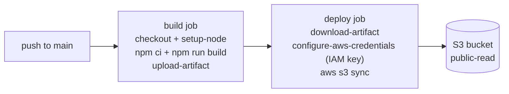
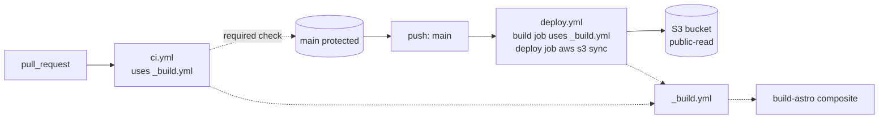
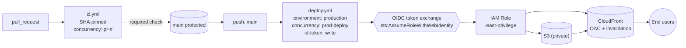

# Cloud CI/CD with GitHub Actions

Build, test, and ship with *confidence*.

---

# Introduction to Teacher

---

## Erik Reinert aka "Blackglasses"

- Senior software engineer
- Content creator (@TheAltF4Stream)
- Diagram & flowchart artist
- Habitual problem solver

---

## Work Experience

- Started with frontend (2+ years)
- Followed curiosity to backend (2+ years)
- Continued curiosity to fullstack (2+ years)
- Found passion in DevOps & Platform Engineering (5+ years - current)

---

## I build things on the internet

- Blog: https://altf4.blog
- Github: https://github.com/ALT-F4-LLC
- Twitch: https://www.twitch.tv/thealtf4stream
- Twitter: https://www.x.com/thealtf4stream
- YouTube: https://www.youtube.com/thealtf4stream
- Vorpal: https://docs.vorpal.build

---

## Existing Courses

- Introduction to DevOps for Developers
- Enterprise Cloud Infrastructure
- Introduction to Backend Architectures
- Cloud Infrastructure: Startup to Scale

---

## Introduction to DevOps for Developers

Take your first steps into DevOps guided from the perspective of a developer! Improve software teams' ability to build and ship software reliably.

---

## Enterprise Cloud Infrastructure

Learn to set up large-scale systems with GitOps and optimized CI/CD workflows. See strategies to standardize your organization's approach to cloud resource management and dynamic orchestration.

---

# Course Introduction

---

## Goals in this course

- Ship a "simple" frontend with GitHub Actions
- Recognize three stages of CI/CD maturity
- Know when to escalate from "it works" to "it's safe"
- Build a pipeline you'd be okay handing to a security review

---

## Pre-requisites for this course

- GitHub account (free plan is fine)
- AWS account on the free tier with admin access
- Node (v22) installed locally

---

## Reference repository

- https://github.com/ALT-F4-LLC/fem-cicd-service

---

## Reference branches

- Proof-of-concept end state -> `git checkout poc`
- Stable end state -> `git checkout stable`
- Enterprise end state -> `git checkout enterprise`

---

## Working branch

- Workshop -> `git checkout feature/main` (use `main` in your repo)

---

# Course Structure

---

## Three Stages

- Proof-of-concept - "Just get it deployed!"
- Stable - "Make it safe to collaborate!"
- Enterprise - "Make it safe to operate!"

---

## Same artifact, three pipelines

- One trivial `dist/` evolves with three increasingly mature pipelines
- The diff between pipelines IS the workshop
- By the end, you can articulate which pipeline fits which moment

---

## Proof-of-concept

> "Just get it deployed!"

---

## Stable

> "Make it safe to collaborate!"

---

## Enterprise

> "Make it safe to operate!"

---

# Stage 1 - Proof-of-concept

---

## Proof-of-concept

> "Just get it deployed!"

---

## Phase Scenario

- We have working source code
- We need a solution in front of a user this week
- We are willing to do the wrong thing on purpose
- We will name what's wrong as we go

---

## Phase Goals

- One workflow file in the repo
- Build the frontend in CI
- Ship `dist/` to S3 on push to `main`

---

## Phase Requirements

- A clean GitHub repo on `main` only
- An S3 bucket with static website hosting (public-read)
- An IAM user with programmatic S3 access
- Repo secrets ready to receive the access key pair

---

## End-of-POC pipeline

---

## Your First Workflow

- Workflows are YAML in `.github/workflows/`
- No separate CI server to configure
- The smallest workflow is a single `echo`
- See one run end-to-end before naming concepts

---

## Triggers & Runners

- `on:` is WHEN
- `runs-on:` is WHERE
- Each job runs on a fresh VM - no shared state between jobs
- Self-hosted exists; we revisit in segment 15

---

## Triggers we actually use

- `push: branches: [main]` - narrowed from "any push"
- `workflow_dispatch` - the manual button
- `pull_request` - coming in Stable
- Everything else: read the docs when you need it

---

## Contexts & Expressions

- `${{ ... }}` is the only place YAML has logic
- Read who triggered the run, on what ref, from what event
- Gate steps with `if:`
- If you need real logic, write a script - not more `${{ }}`

---

## The contexts that matter today

- `github` - actor, ref, event_name, sha
- `runner` - OS, temp dir
- `secrets` - encrypted values (NOT readable in `if:`)
- `vars` - repo-level variables (readable everywhere)

---

## Building a CI Pipeline

- Three steps every Node project needs: checkout, setup-node, install + build
- Then add AWS credentials and `aws s3 sync`
- The build IS the test for a static site

---

## Yes, we are doing the wrong thing on purpose

- IAM user access key pasted into repo secrets
- Anyone with write access to the repo can exfiltrate it

---

## NO LONG-LIVED CREDENTIALS

> Long-lived AWS keys in repo secrets is the original sin of CI/CD.
> We're committing it now so the OIDC payoff lands later.

---

## Job Dependencies & Artifacts

- Real pipelines split build from deploy
- Each job runs on a fresh runner - no shared filesystem
- `upload-artifact` / `download-artifact` move the bytes
- `needs:` declares the ordering

---

## Why split build and deploy?

- The artifact becomes a first-class object
- You can redeploy without rebuilding
- Multiple deploy targets reuse the same build
- A failed build short-circuits before any deploy fires

---

## Start building!

---

## End-of-POC recap

- Push to `main` builds and deploys to S3
- Two jobs, one artifact, one workflow file
- Long-lived credentials, no review, no caching, no concurrency
- We named the problems STABLE will solve

---

## Phase Changes

- added `.github/workflows/deploy.yml`
- added repo secrets for AWS credentials
- added an S3 bucket and bucket policy out-of-band
- one workflow, two jobs, one artifact

---

## Phase Pros

- Push and ship, a developer can read it
- One workflow file is auditable end-to-end
- Zero infrastructure beyond a bucket
- Fastest path to "users see the site"

---

## Phase Cons

- Long-lived AWS keys in repo secrets
- No review, every push deploys
- No caching, install every run
- No concurrency, last writer wins, non-deterministically

---

# Stage 2 - Stable

---

## Stable

> "Make it safe to build!"

---

## Phase Scenario

- Proof-of-concept is shipping
- Now multiple people want to commit
- We need a PR gate before code reaches `main`
- We need workflow code we are not embarrassed to read

---

## Phase Goals

- Cache npm so installs finish in seconds
- Validate pull requests before they merge
- Extract the build sequence to ONE place
- Protect `main` so direct pushes are blocked

---

## Phase Requirements

- POC pipeline is green on `main`
- A feature branch ready for the PR demo
- `ACTIONS_STEP_DEBUG` slot ready for the debugging demo
- Branch-protection settings tab open in the browser

---

## End-of-Stable pipeline

---

## Caching & Debugging

- Cache is the highest-leverage change you can make
- `setup-node` with `cache: 'npm', short and hard to misconfigure
- `actions/cache` - when you need something setup-node doesn't know about
- `ACTIONS_STEP_DEBUG=true` is the equivalent of `set -x`

---

## Yes, this fails on purpose

- We will deliberately mistype the cache key
- CI goes red, we read the log
- A red CI is the signal the pipeline exists for, not a problem to hide
- Recognize the failure pattern when you meet it for real

---

## Marketplace & Composite Actions

- Marketplace is a directory, not a registry
- Treat actions like third-party deps
- A composite action wraps a step sequence inside a single job
- It can have inputs and outputs, but no `runs-on:` of its own

---

## Reading a marketplace action

- Publisher: first-party (`actions/`, `aws-actions/`) or community
- Release cadence: three years quiet is a risk
- Star count: not quality, but blast radius
- Security advisories tab: has it been audited

---

## Why a composite for the build sequence

- setup-node + install + build + upload-artifact = one logical unit
- Future workflows in this repo will call the same composite
- Local composites can't bootstrap their own checkout
- Checkout stays in the calling job - every time

---

## Reusable Workflows

- A reusable workflow wraps a whole job (or jobs)
- Triggered by `on: workflow_call`
- Runs as its OWN job with its OWN runner
- Composite is step-level; reusable is job-level

---

## What branch protection actually does

- Required checks turn CI from advisory into enforced
- `main` no longer accepts direct pushes
- Merging the PR is the only way bytes reach `main`
- This is the moment "multi-contributor" stops being theoretical

---

## Composite vs. Reusable vs. Custom

- Step sequence in one job? Composite.
- Whole job, possibly across repos? Reusable workflow.
- Logic that doesn't fit YAML? Custom JS or Docker action.
- Three mechanisms, three different questions.

---

## Default to composite

- Simpler to author
- Logs appear inline in the calling job
- Zero runtime overhead
- Reach for reusable when the unit is GENUINELY a job

---

## Start building!

---

## End-of-Stable recap

- PRs gate `main` via branch protection
- Builds are cached and finish in seconds
- The build sequence lives in one place, called from two workflows
- Long-lived keys are still there. We'll fix it next.

---

## Phase Changes

- added `.github/actions/build-astro/action.yml`
- added `.github/workflows/_build.yml`
- added `.github/workflows/ci.yml`
- modified `deploy.yml` to call the reusable
- enabled branch protection on `main`

---

## Phase Pros

- Bad code can't reach `main` without review
- Builds are fast (npm cache)
- One source of truth for the build sequence
- The pipeline is portfolio-grade

---

## Phase Cons

- Long-lived AWS keys still in repo secrets
- Deploys still automatic on merge, no human gate
- Actions pinned to mutable major-version tags
- S3 bucket still public-read, no CDN

---

# Stage 3 - Enterprise

---

## Enterprise

> "Make it safe to operate!"

---

## Phase Scenario

- The pipeline works and the team trusts it
- Now a security review is on the calendar
- Long-lived keys, public buckets, mutable tags - all findings
- We have to make the pipeline reviewable

---

## Phase Goals

- Replace long-lived AWS keys with OIDC
- Gate the deploy on a human
- Pin actions to commit SHAs
- Front S3 with CloudFront + OAC
- Add concurrency control

---

## Phase Requirements

- IAM role pre-created with OIDC trust policy
- GitHub OIDC provider already trusted in AWS
- CloudFront distribution pre-staged (Disabled)
- S3 bucket policy ready to flip to OAC-only

---

## End-of-Enterprise pipeline

---

## Environments & Protection Rules

- An environment is a named bundle of rules and secrets
- Required reviewers, pause until a human approves
- Wait timer, the "are you SURE?" guardrail
- Free for public repos; paid plan for private

---

## Five seconds of dead air

> The wait timer is not a queue - it's a brake.

---

## Why environments come first in Enterprise

- The `production` environment is the principal
- The OIDC trust policy will bind to that principal

---

## OIDC & Cloud Authorization

- Short-lived credentials minted at runtime
- The keys never sat in GitHub
- The trust policy is principal-level least privilege
- A leaked workflow file from another repo can't mint our credentials

---

## How OIDC works (mental model)

- GitHub mints a signed token describing this run
- AWS verifies the signature and reads the claims
- Claims must match the IAM trust policy
- AWS exchanges the token for credentials that expire in an hour

---

## NO LONG-LIVED CREDENTIALS - FINALLY GONE

> The `AWS_ACCESS_KEY_ID` secret is deleted on stage.
> The `AWS_SECRET_ACCESS_KEY` secret is deleted on stage.
> The list is empty. The leak surface no longer exists.

---

## CloudFront + OAC closes the loop

- S3 flips from public-read to private
- Only the OAC service principal can read objects
- CloudFront becomes the public surface
- The deploy job invalidates the cache after sync

---

## Hardening Your Workflows

- SHA-pinning freezes the action at the code we reviewed
- Deny-all permissions is auditable
- A reader of the workflow can answer "what can this do?" without GitHub's defaults table
- Mechanical work - every `uses:` re-pinned with a comment

---

## Mutable tag = Russian roulette

> A publisher's `@v4` tag could be re-pointed to malicious code overnight.
> Every workflow on the planet pinned to `@v4` re-fetches that code on its next run.
> The 40-character SHA freezes you on the version you reviewed.

---

## Where SHAs live

- `_build.yml`
- `ci.yml`
- `deploy.yml`
- `build-astro/action.yml` (don't forget the composite!)
- Each `uses:` gets a SHA and a `# vX.Y.Z` comment

---

## Permissions: deny-all by default

- Workflow level: `permissions: {}`
- Each job grants ONLY what it needs
- `contents: read` for jobs that checkout
- `id-token: write` ONLY on the deploy job

---

## Concurrency & Self-Hosted Runners

- Concurrency groups serialize where order matters
- Concurrency groups parallelize where it doesn't
- PR validation - cancel superseded runs
- Production deploys - queue, never cancel

---

## Why deploys never cancel

- A deploy mid-sync leaves S3 and CloudFront inconsistent
- You don't want to find out at 4 PM Friday that half your assets are old
- Cancellation is safe when work is idempotent
- It's unsafe when work has side effects partway through

---

## Start building!

---

## End-of-Enterprise recap

- OIDC removed long-lived credentials
- `production` environment gates the deploy
- SHA-pinning freezes third-party code
- Concurrency controls prevent races
- The pipeline is now reviewable

---

## Phase Changes

- added `production` environment with reviewers + wait timer
- replaced AWS keys with OIDC `role-to-assume`
- enabled CloudFront with OAC, made S3 private
- pinned every `uses:` to a 40-char SHA
- added deny-all permissions plus per-job grants
- added concurrency groups to both workflows

---

## Phase Pros

- No long-lived credentials anywhere
- Human in the loop before production changes
- Third-party action drift is impossible
- Production deploys are serialized
- Workflow files are reviewable by security

---

## Phase Cons

- More moving parts to operate
- AWS-side setup is a real prerequisite
- SHA bumps need Dependabot or human discipline
- The team has to actually use the reviewer gate

---

# Course Recap

---

## What did we do?

- Shipped the same `dist/` artifact through three pipelines
- Watched a workflow grow from simple to OIDC + CloudFront
- Named what was wrong at every stage before fixing it

---

## What did we learn?

- How to scope a CI/CD change to the moment the team is in
- How to recognize a deploy ready for a security review
- How to choose between composite, reusable, and custom actions
- How to read a marketplace action like a third-party dep

---

## Three-stage progression

- Proof-of-concept: push and ship, do the wrong thing knowingly
- Stable: PR-gated, cached, DRY, branch-protected
- Enterprise: OIDC, environments, SHAs, concurrency, CDN

---

## Thanks for watching

---

## I build things on the internet

- Blog: https://altf4.blog
- Github (company): https://github.com/ALT-F4-LLC
- Github (personal): https://github.com/erikreinert
- Twitch: https://www.twitch.tv/thealtf4stream
- Twitter: https://www.x.com/thealtf4stream
- YouTube: https://www.youtube.com/thealtf4stream
- Vorpal: https://docs.vorpal.build