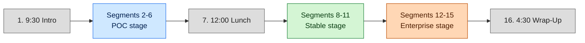
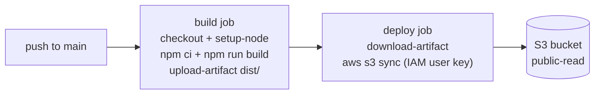
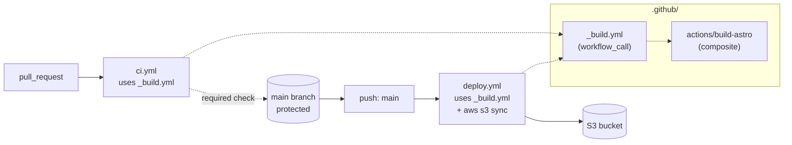
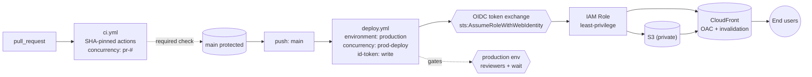
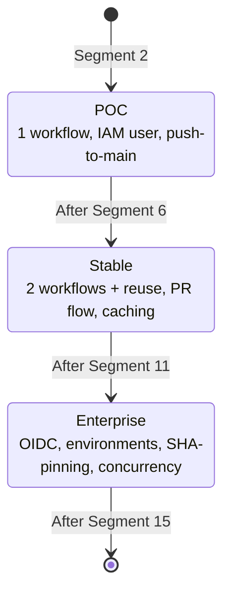

# Frontend Masters CI/CD Workshop — Architecture TDD

## 1. Problem Statement

### What

The Frontend Masters "Cloud CI/CD with GitHub Actions" workshop has no instructor guide. The course is a full-day, 16-segment live session that teaches end-to-end CI/CD by progressively building a deployment pipeline for a trivial frontend application. Without a guide, the instructor has no canonical reference for what to demonstrate at each segment, what to skip, what to defer to a later stage, or how to keep the live build coherent across the day.

This TDD does NOT produce the instructor guide itself. It locks the **technical decisions** that the instructor docs (`OUTLINE.md`, `POC.md`, `STABLE.md`, `ENTERPRISE.md`) will teach against. Its audience is `@project-manager` (who will decompose this into Docket issues) and `@senior-engineer` (who will write the markdown).

### Why now

- The workshop will be delivered live; ad-hoc instruction risks demo failures, conceptual drift between segments, and inconsistent terminology.
- A three-stage progression (POC → Stable → Enterprise) is pedagogically powerful but only if every segment maps cleanly to exactly one stage. Mapping ambiguity will cost live-teaching time.
- Four parallel docs (OUTLINE + three stage guides) cannot stay consistent without a shared spec for the sample app, AWS topology, and workflow file evolution.

### Constraints

- **Markdown only.** No `.yml`, `.ts`, `.js`, `.json`, `.tf`, or shell scripts will be committed by this workshop's documentation effort. All workflow files, Astro source, and AWS resources are described in prose and fenced code blocks within markdown — never extracted as runnable files.
- **No real cloud provisioning.** No live AWS account is created, no Terraform is run, no real IAM roles exist. Pricing is conceptual ("free tier covers this") rather than calculated.
- **Sample app stays trivial.** A single Astro page rendering "Hello, world" — zero routing, zero data, zero JS interactivity beyond what Astro emits for a static page. Any deviation is scope creep.
- **Bound to FEM's existing 16-segment agenda.** The instructor docs follow FEM's published time blocks; the three-stage progression must overlay this agenda, not replace it.
- **Live-teachable in real time.** Every "Live build" step must be demonstrable on stage in the segment's allotted minutes. If a step requires more than ~5 minutes of typing or waiting, it must be split, pre-staged, or moved.
- **Workshop reference repository is PUBLIC on GitHub Free plan.** The instructor's pre-staged repo and any student follow-along repos must be public. This constrains which GitHub features the workshop can *require* end-to-end:
  - **Free on public repos (workshop may require):** GitHub Environments with Required Reviewers and Wait Timers, branch protection rules with required status checks, self-hosted runners (free on any plan, public or private).
  - **Paid-only on private repos:** the same Environments / Required Reviewers / Wait Timers features require Pro+/Team/Enterprise on private repos. The workshop may *mention* this ("on a paid plan you'd also get X on private repos") but must not require a paid plan to complete any Live build.
  - **Implication for §5.3 Enterprise stage:** the segment 12 environment-gate demo and the segment 14/15 hardening demos all run on Free + public, which is why the stage is teachable end-to-end without billing setup.

### Acceptance criteria for the workshop deliverable (not this TDD)

- All 16 FEM segments are referenced by name and time in `OUTLINE.md`.
- Each of the three stage docs (`POC.md`, `STABLE.md`, `ENTERPRISE.md`) contains a complete "Live build" narrative that ends with a working workflow file, described in markdown.
- No `.yml` or `.ts` files are committed.
- All four docs reference the same sample-app spec (this TDD section 4).
- The four docs cross-link: outline links to stage docs at the segment boundaries; stage docs link back to the outline.

## 2. Context & Prior Art

### FEM workshop format

Frontend Masters workshops are full-day, instructor-led, hands-on courses with a published agenda. The 16-segment schedule for "Cloud CI/CD with GitHub Actions" is:

| # | Time  | Segment                                  |
|---|-------|------------------------------------------|
| 1 | 9:30  | Introduction                             |
| 2 | 9:45  | Your First Workflow                      |
| 3 | 10:00 | Triggers & Runners                       |
| 4 | 10:30 | Contexts & Expressions                   |
| 5 | 11:00 | Building a CI Pipeline                   |
| 6 | 11:30 | Job Dependencies & Artifacts             |
| 7 | 12:00 | Lunch                                    |
| 8 | 12:45 | Caching & Debugging Workflows            |
| 9 | 1:15  | Marketplace & Composite Actions          |
| 10| 2:00  | Reusable Workflows                       |
| 11| 2:35  | Composite vs. Reusable vs. Custom        |
| 12| 3:00  | Environments & Protection Rules          |
| 13| 3:30  | OIDC & Cloud Authorization               |
| 14| 4:00  | Hardening Your Workflows                 |
| 15| 4:15  | Concurrency & Self-Hosted Runners        |
| 16| 4:30  | Wrap-Up                                  |

### Prior art for staged CI/CD pedagogy

- **AWS Well-Architected** uses a similar maturity progression (proof-of-concept → production → enterprise) for cloud workloads. We borrow the framing.
- **GitHub's own "Learn GitHub Actions" path** introduces concepts in the same order FEM uses (workflow → triggers → context → CI → reuse → security), which lets us overlay stages without fighting the agenda.
- **Astro's documentation site** uses GitHub Actions to deploy itself to a CDN — the canonical "static site to S3" pattern is well-trodden, low-risk, and doesn't require backend infrastructure.
- **OWASP CI/CD Top 10** informs the Enterprise stage: OIDC instead of long-lived keys (CICD-SEC-2), SHA-pinned third-party actions (CICD-SEC-3), least-privilege IAM (CICD-SEC-1).

### Architectural constraints we are working under

- The repo is a clean slate (initial commit only). No existing workflows, app code, or infrastructure to integrate with — every decision is greenfield.
- The repo holds only documentation. No CI runs against this repo because there is no code to test. The workflows described in the docs are conceptual exemplars, not active pipelines for this repo.

## 3. Alternatives Considered

### Alternative A: Three separate sample apps, one per stage

Each stage uses a different sample app, scoped to the complexity of that stage.

- **Strengths:** Lets each stage demo features specific to its complexity (e.g., Enterprise gets a multi-package monorepo).
- **Weaknesses:** Students must context-switch on the app three times; conceptual continuity is broken; instructor must explain three codebases in 6 hours; the workshop is about CI/CD, not about apps. **Rejected.**

### Alternative B (recommended): One sample app, three workflow generations

A single trivial Astro app is built once at segment 2 and used for the rest of the day. The CI/CD pipeline evolves through three stages while the app remains unchanged.

- **Strengths:** All complexity is in the pipeline, where the workshop's value lies. Diff between stages is the *workflow files*, not the app — exactly what students need to see. Pedagogically clean.
- **Weaknesses:** The app must be trivial enough that no segment is tempted to extend it; the instructor must resist mid-day app changes. Mitigated by the explicit sample-app spec in section 4.
- **Recommendation:** Adopt.

### Alternative C: No sample app — workflows demonstrated against `echo` commands

Workflows are demonstrated with placeholder `echo "build"`, `echo "test"` steps with no real artifact.

- **Strengths:** Maximum focus on Actions syntax; zero app surface area to teach.
- **Weaknesses:** "Job Dependencies & Artifacts" (segment 6) and "Caching" (segment 8) are meaningless without real build output. OIDC + S3 deployment (segments 12–13) requires *something* to deploy. Students lose the satisfaction of a working pipeline. **Rejected.**

### Alternative D: Stage progression keyed to time blocks, not concepts

Stages map to morning / afternoon / late-afternoon based on clock time alone.

- **Strengths:** Easy to teach — one stage per time block.
- **Weaknesses:** Forces unrelated concepts into the same stage (e.g., "Caching" and "Reusable Workflows" both fall into a single stable bucket regardless of conceptual fit). Loses the maturity-progression narrative. **Rejected.**

### Recommendation

**Alternative B + concept-keyed stage mapping** (section 7). One sample app, workflows evolve through three stages, each stage maps to a contiguous concept block in the FEM agenda.

## 4. Sample-App Specification

The sample app is a single-page Astro site emitting "Hello, world" with TypeScript. It is built once at FEM segment 2 and is **never modified** during the workshop. Every workflow change throughout the day operates on this fixed artifact.

### 4.1. File layout

```
fem-cicd-sample-app/
├── package.json
├── package-lock.json
├── tsconfig.json
├── astro.config.mjs
├── .gitignore
├── README.md
└── src/
    └── pages/
        └── index.astro
```

`package-lock.json` is committed alongside `package.json`. The lockfile is required by `npm ci` (used in workflows from segment 5 onward) and by `actions/setup-node`'s `cache: 'npm'` keying. Without a committed lockfile, segment 5's first build fails immediately.

### 4.2. `package.json` — required fields

- `name`: `"fem-cicd-sample-app"`
- `type`: `"module"`
- `private`: `true`
- `scripts`:
  - `dev`: `"astro dev"`
  - `build`: `"astro build"`
  - `preview`: `"astro preview"`
- `dependencies`: `astro` (latest stable major), `typescript` (peer of Astro's recommendation)
- `devDependencies`: none beyond what `astro add typescript` produces
- `engines.node`: `">=22.22.0"` — pinned to a specific minor so local installs match the CI runner. Workflow `setup-node` `node-version` mirrors this as `22.22` (see §11.2 Q5).
- No lint, no test framework, no Prettier — these would distract from CI/CD. The CI pipeline tests only `npm run build`.

> **Instructor note:** When students ask "where are the tests?", the answer is "the build itself is the test for a static site — if the TypeScript compiles and Astro produces a `dist/`, the pipeline is green." This is intentional: the workshop teaches CI/CD, not testing strategy.

### 4.3. `astro.config.mjs` — required shape

- `output`: `"static"`
- `site`: documented as a placeholder string (e.g., `"https://example.com"`); not load-bearing for S3 deploys.
- No integrations beyond TypeScript (which Astro handles natively).
- No adapters (we deploy static output to S3, not via SSR).

### 4.4. `tsconfig.json`

Extends `astro/tsconfigs/strict`. No customization.

### 4.5. `src/pages/index.astro` — content

A single Astro page with frontmatter declaring a `const greeting: string = "Hello, world";` and a body rendering `<h1>{greeting}</h1>` inside a minimal HTML scaffold (`<html lang="en">`, `<head>` with `<title>`, `<body>`). No CSS imports, no client-side JavaScript, no images.

### 4.6. `.gitignore`

Standard Astro ignore: `dist/`, `node_modules/`, `.astro/`, `.env`, `.DS_Store`.

### 4.7. `README.md`

Three sections: what it is (one sentence), how to run locally (`npm install && npm run dev`), how to build (`npm run build`). Explicitly states it is a workshop artifact and not for production use.

### 4.8. Build artifact

`npm run build` produces a `dist/` directory containing `index.html` and any Astro-emitted assets. This `dist/` is the only thing deployed to S3 in any stage. Total artifact size is expected to be under 50 KB — fits trivially in any caching, artifact-upload, or S3 sync demonstration.

### 4.9. What is intentionally NOT in the sample app

- No tests (Vitest, Jest, Playwright) — the build is the test.
- No linting (ESLint, Prettier) — would inflate "Building a CI Pipeline" beyond its time budget.
- No environment variables — would require secrets handling before segment 13 (OIDC).
- No multiple pages or routes — would tempt the instructor into Astro tangents.
- No CSS framework, no UI library — keeps `npm install` time predictable on workshop wifi.
- No package manager beyond npm — Yarn/pnpm choice is out of scope.

## 5. Three-Stage Architecture

The three stages are defined by what *concretely changes* in the GitHub Actions configuration and the AWS topology — not by abstract qualities like "more mature" or "more secure."

### 5.1. Stage 1 — POC ("Make it deploy")

**FEM segments covered:** 2–6 (Your First Workflow → Job Dependencies & Artifacts).

**Goal:** A single workflow that deploys `dist/` to S3 on every push to `main`. No safety, no review, no caching. Students leave segment 6 with a working pipeline they could have shipped in 2014.

**GitHub Actions characteristics:**

- Single workflow file: `.github/workflows/deploy.yml`.
- Trigger: `on: push: branches: [main]`.
- Single job with sequential steps: checkout → setup-node → `npm ci` → `npm run build` → `aws s3 sync dist/ s3://...`.
- By segment 6, the single job is split into two: `build` and `deploy`, with `deploy: needs: build` and a build artifact uploaded/downloaded between them. This is the segment 6 demonstration.
- No matrix builds, no caching, no environments, no concurrency, no reusable workflows.

**AWS topology:**

- Single S3 bucket configured for static website hosting.
- Bucket policy: public-read (or CloudFront with OAC — see section 6.2).
- One IAM user with programmatic access, scoped to `s3:PutObject`, `s3:DeleteObject`, `s3:ListBucket` on this bucket.
- IAM user's access key ID + secret access key stored in GitHub repository secrets (`AWS_ACCESS_KEY_ID`, `AWS_SECRET_ACCESS_KEY`).
- No CloudFront yet (deferred to Stable or Enterprise per section 6.2).

**Branching:**

- Single branch: `main`.
- No protected branches, no PR flow, no required reviewers. Direct push to main is the demo.

**What's wrong with POC (and why we leave it that way until Stable):**

- Long-lived AWS credentials in GitHub secrets — leak risk.
- No review gate — any push to main hits production.
- No caching — `npm ci` runs from scratch on every push.
- No concurrency control — concurrent pushes can race to deploy.

These are intentional. POC's role is to be the "before" picture against which Stable and Enterprise look obviously better.

### 5.2. Stage 2 — Stable ("Make it safe to collaborate")

**FEM segments covered:** 8–11 (Caching & Debugging → Composite vs Reusable vs Custom).

**Goal:** The same pipeline now supports multiple contributors safely. PRs are validated before merge. Builds are fast. Workflow code is DRY. Students leave segment 11 with a pipeline they would not be embarrassed to put in a portfolio.

**GitHub Actions characteristics:**

- Two workflow files: `.github/workflows/ci.yml` (PR validation) and `.github/workflows/deploy.yml` (push to main).
- `ci.yml` triggers on `pull_request` and runs build + (placeholder) checks. Does not deploy.
- `deploy.yml` triggers on `push: branches: [main]` and reuses the build logic.
- Caching: `actions/cache` for `~/.npm` keyed on `package-lock.json` hash. (`actions/setup-node` with `cache: 'npm'` is the recommended idiomatic form — instructor demonstrates both.)
- Marketplace actions used: `actions/checkout@v4`, `actions/setup-node@v4`, `actions/upload-artifact@v4`, `actions/download-artifact@v4`, `aws-actions/configure-aws-credentials@v4`. Pinned to major version tags (not SHAs) at this stage.
- Composite action extracted: `.github/actions/build-astro/action.yml` wraps the checkout → setup-node → install → build sequence. Reused by both `ci.yml` and `deploy.yml`.
- Reusable workflow extracted: `.github/workflows/_build.yml` with `on: workflow_call`. Demonstrated as an alternative to the composite action; the segment-11 conversation explicitly compares them.

**AWS topology:**

- Same as POC — still S3 + IAM user + access key in secrets. Stable does NOT introduce OIDC; that is Enterprise.
- *Optional:* CloudFront introduced here if the instructor wants to demo cache-busting via `Invalidation` in the deploy job. Decision deferred to OUTLINE.md author. Default: defer CloudFront to Enterprise.

**Branching:**

- `main` is protected. Required status checks: the build job from `ci.yml` must pass before merge.
- All changes go through PR. Direct push to main is blocked.
- Required reviewers: not enforced (the workshop has no real reviewers); explained as "you would set this to 1+ in production."

**What's wrong with Stable (and why Enterprise is needed):**

- Still using long-lived AWS credentials.
- No environment-level approvals (production deploy is automatic on merge).
- Third-party actions are pinned to major tags, which can be re-pointed by the publisher.
- No concurrency control on deploys.

### 5.3. Stage 3 — Enterprise ("Make it safe to operate")

**FEM segments covered:** 12–15 (Environments & Protection Rules → Concurrency & Self-Hosted Runners).

**Goal:** The pipeline meets the security and operational bar a regulated organization would expect. No long-lived cloud credentials. Deploys are gated. Third-party code is verified. Students leave segment 15 with a pipeline they could put in front of a security review.

**GitHub Actions characteristics:**

- Workflow file structure mirrors Stable but with these changes:
  - `deploy.yml` declares `environment: production` on the deploy job. The `production` environment in repo settings has required reviewers and a wait timer.
  - All AWS authentication via `aws-actions/configure-aws-credentials@v4` with `role-to-assume` (an IAM role ARN) and `aws-region`. No `aws-access-key-id` / `aws-secret-access-key` inputs. Permissions block on the job: `id-token: write, contents: read`.
  - All third-party actions pinned to full commit SHAs with a comment naming the version (e.g., `actions/checkout@<40-char-sha> # v4.1.7`). First-party `aws-actions/*` actions discussed but pinned the same way for consistency.
  - `permissions:` block at workflow level, denying all by default and granting only what each job needs.
  - `concurrency:` block on the deploy workflow, group `production-deploy`, `cancel-in-progress: false` (so production deploys queue rather than cancel; CI workflows on PRs use `cancel-in-progress: true` keyed on PR number).
  - GitHub repository secrets are removed for AWS credentials (no longer needed). Remaining secrets: only the IAM role ARN, which can also be a vars value rather than a secret.
- Self-hosted runners: discussed conceptually in segment 15 as an option for VPC-internal deploys or large workloads. Not demonstrated live (would require infrastructure outside scope). The OUTLINE explicitly marks this as "discussion-only."

**AWS topology:**

- S3 bucket (same one).
- CloudFront distribution in front of S3 (introduced here if not in Stable). Origin Access Control (OAC) so the bucket is no longer public-read.
- IAM **role** (not user) trust-policied to GitHub's OIDC provider (`token.actions.githubusercontent.com`). The trust policy's `Condition` block restricts to the specific `repo:ALT-F4-LLC/fem-cicd-service:ref:refs/heads/main` (or environment-scoped) — least privilege at the principal level.
- IAM role's permission policy: `s3:PutObject`, `s3:DeleteObject`, `s3:ListBucket` on the bucket, plus `cloudfront:CreateInvalidation` on the distribution. No wildcards.
- No IAM access keys exist. The previous IAM user is described as "deleted" in the narrative.

**Branching:**

- Same as Stable: protected `main`, PRs required, status checks required.
- Adds: `production` environment as a deploy gate. `staging` environment optionally introduced if instructor wants to show two-environment promotion (deferred to OUTLINE author).

### 5.4. Stage progression at a glance

| Dimension              | POC                          | Stable                            | Enterprise                                       |
|------------------------|------------------------------|-----------------------------------|--------------------------------------------------|
| AWS auth               | IAM user access key in secrets | Same                            | OIDC + IAM role, no long-lived keys              |
| Workflow files         | 1 (`deploy.yml`)             | 2 (`ci.yml` + `deploy.yml`) + composite + reusable | Same shape, hardened                  |
| Triggers               | `push: main`                 | `push: main`, `pull_request`      | Same                                             |
| Branch protection      | None                         | Required checks on `main`         | Same + environment gate                          |
| Caching                | None                         | `actions/cache` or `setup-node` cache | Same                                          |
| Action pinning         | Major tags                   | Major tags                        | Full SHAs                                        |
| Concurrency            | None                         | None                              | Configured per workflow                          |
| Environments           | None                         | None                              | `production` with reviewers + wait               |
| AWS frontdoor          | S3 only (public)             | S3 (optionally + CloudFront)      | S3 + CloudFront with OAC                         |
| Reusable workflow code | None                         | Composite action + reusable workflow | Same                                          |

## 6. AWS Topology

### 6.1. Service summary by stage

| AWS service              | POC             | Stable          | Enterprise         |
|--------------------------|-----------------|-----------------|--------------------|
| S3 bucket (static site)  | Yes             | Yes             | Yes                |
| Bucket public access     | Public-read     | Public-read     | Blocked (OAC only) |
| CloudFront distribution  | No              | Optional        | Yes                |
| IAM user                 | Yes             | Yes             | No (deleted)       |
| IAM role                 | No              | No              | Yes (OIDC trust)   |
| GitHub OIDC provider     | No              | No              | Yes                |

### 6.2. CloudFront placement decision

CloudFront introduces real complexity: distribution creation, invalidation, OAC setup, propagation delays. We have two choices for when to introduce it:

- **Option A: Introduce in Stable.** Pro: lets Stable demo cache invalidation in the deploy workflow. Con: tangles a CDN concept into a stage that is supposed to be about *workflow code reuse and contributor flow*, not infrastructure.
- **Option B (default): Introduce in Enterprise.** Pro: keeps Stable focused on Actions concepts. Con: Stable's deploy workflow has the artifact go to a public-read bucket, which feels less polished.

**Recommendation:** Option B — defer CloudFront to Enterprise. CloudFront pairs naturally with OIDC and OAC (both are about minimizing exposed surface area). The OUTLINE.md author may override if Stable's segment 9 ("Marketplace & Composite Actions") needs a CloudFront-invalidation marketplace action as a teaching example, but should justify the move in OUTLINE.

### 6.3. Bucket policy shape (described, not committed)

- **POC:** Public-read on the bucket; `s3:GetObject` allowed for principal `*`. Bucket has static website hosting enabled.
- **Stable:** Same as POC unless CloudFront is introduced early.
- **Enterprise:** Public access blocked. Bucket policy grants `s3:GetObject` only to the CloudFront distribution's OAC service principal, conditioned on the distribution ARN. Static website hosting disabled (CloudFront serves content).

### 6.4. IAM trust-policy shape (Enterprise, described, not committed)

- Principal: GitHub Actions OIDC provider (`token.actions.githubusercontent.com`).
- Action: `sts:AssumeRoleWithWebIdentity`.
- Condition:
  - `StringEquals` on `aud` to `sts.amazonaws.com`.
  - `StringLike` on `sub` to `repo:ALT-F4-LLC/fem-cicd-service:environment:production` (binds to environment) — or `repo:.../ref:refs/heads/main` if not using environments. Instructor uses the environment-bound form to reinforce the segment-12 lesson.

### 6.5. What we do NOT teach about AWS

- VPCs, subnets, security groups (no compute is provisioned).
- Route 53 / ACM (custom domains explicitly out of scope).
- CloudFormation / Terraform / CDK (workshop is about Actions, not IaC).
- Multi-region deployments.
- Cost optimization beyond "this fits in free tier."

## 7. FEM-Segment → Stage Mapping

This is the canonical mapping. All four instructor docs MUST agree with this table.

| #  | Time  | Segment                              | Stage             | Notes                                                      |
|----|-------|--------------------------------------|-------------------|------------------------------------------------------------|
| 1  | 9:30  | Introduction                         | (interlude)       | Workshop overview, three-stage roadmap, sample-app reveal. |
| 2  | 9:45  | Your First Workflow                  | POC               | First commit of `deploy.yml`. Hello-world workflow run.    |
| 3  | 10:00 | Triggers & Runners                   | POC               | `on:` keyword variations, `runs-on:` choices.              |
| 4  | 10:30 | Contexts & Expressions               | POC               | `${{ github.* }}`, `if:` conditions on steps.              |
| 5  | 11:00 | Building a CI Pipeline               | POC               | Add build step. Workflow now produces `dist/`.             |
| 6  | 11:30 | Job Dependencies & Artifacts         | POC               | Split into `build` + `deploy` jobs with artifact handoff. End of POC stage. |
| 7  | 12:00 | Lunch                                | (interlude)       | No teaching content. OUTLINE marks as break.               |
| 8  | 12:45 | Caching & Debugging Workflows        | Stable            | Add npm cache. Demo `ACTIONS_STEP_DEBUG`.                  |
| 9  | 1:15  | Marketplace & Composite Actions      | Stable            | Introduce marketplace actions; extract composite action.   |
| 10 | 2:00  | Reusable Workflows                   | Stable            | Extract reusable workflow with `workflow_call`.            |
| 11 | 2:35  | Composite vs. Reusable vs. Custom    | Stable (compare)  | Comparison segment. No new code. End of Stable stage.      |
| 12 | 3:00  | Environments & Protection Rules      | Enterprise        | Create `production` environment. Add reviewers.            |
| 13 | 3:30  | OIDC & Cloud Authorization           | Enterprise        | Replace access keys with OIDC + IAM role.                  |
| 14 | 4:00  | Hardening Your Workflows             | Enterprise        | SHA-pin actions; minimal `permissions:` block.             |
| 15 | 4:15  | Concurrency & Self-Hosted Runners    | Enterprise        | Add `concurrency:`. Discuss self-hosted (no live demo). End of Enterprise stage. |
| 16 | 4:30  | Wrap-Up                              | (interlude)       | Recap three stages. Pointer to further reading.            |

**Stage boundaries are hard:** segments 2–6 = POC, 8–11 = Stable, 12–15 = Enterprise. Segments 1, 7, and 16 are interludes (no stage). The mapping is final once this TDD is accepted; instructor docs must not relocate segments between stages.

## 8. Branch / Repo / Workflow File Layout Progression

The instructor docs describe the same repository at three points in time. The repo state at the end of each stage is:

### 8.1. End of POC (after segment 6)

```
fem-cicd-sample-app/
├── package.json
├── tsconfig.json
├── astro.config.mjs
├── .gitignore
├── README.md
├── src/pages/index.astro
└── .github/
    └── workflows/
        └── deploy.yml          # build + deploy on push to main
```

Branch: `main` only. No protection.

### 8.2. End of Stable (after segment 11)

```
fem-cicd-sample-app/
├── ... (sample app unchanged) ...
└── .github/
    ├── actions/
    │   └── build-astro/
    │       └── action.yml      # composite action
    └── workflows/
        ├── _build.yml          # reusable workflow (workflow_call)
        ├── ci.yml              # PR validation
        └── deploy.yml          # push to main, calls _build.yml
```

Branch: `main` (protected, required check from `ci.yml`). Feature branches via PR.

### 8.3. End of Enterprise (after segment 15)

```
fem-cicd-sample-app/
├── ... (sample app unchanged) ...
└── .github/
    ├── actions/
    │   └── build-astro/
    │       └── action.yml      # SHA-pinned internal refs
    └── workflows/
        ├── _build.yml          # SHA-pinned, scoped permissions
        ├── ci.yml              # SHA-pinned, concurrency on PR number
        └── deploy.yml          # SHA-pinned, OIDC, environment, concurrency
```

GitHub repo settings additions: `production` environment with reviewers + wait timer; OIDC provider trust configured with AWS.

Branch: `main` (protected); feature branches; `production` environment gates the deploy job.

> All three states are described in markdown only. No actual files in any of these layouts are committed to this repository — they are illustrative.

## 9. Instructor Doc Conventions

To keep `OUTLINE.md`, `POC.md`, `STABLE.md`, and `ENTERPRISE.md` consistent, all four follow the conventions below. Deviations require sign-off in a follow-up TDD revision.

### 9.1. File-level structure

Every instructor doc starts with:

- **Frontmatter** (same shape as this TDD: `project`, `maturity`, `last_updated`, `updated_by`, `scope`, `owner`, `status`).
- **Stage banner** (one paragraph): which stage this doc covers, which FEM segments, what the student walks away with.
- **Pre-flight** section: what must be set up before this stage (e.g., AWS account, GitHub repo, sample app committed). For OUTLINE.md, this is "what the instructor must verify before the workshop starts."
- **Per-segment sections** (see 9.2).
- **End-of-stage recap**: one short section summarizing the workflow file state at the end of the stage and what is still missing (the "what's wrong with this stage" framing from sections 5.1–5.3).

### 9.2. Per-segment section structure

Each FEM segment within a stage doc is its own H2 heading using this exact format:

```
## Segment N — HH:MM — Segment Title
```

Under each segment heading, the following H3 subsections appear in this order:

1. **Talking points** — bulleted list of the 3–5 conceptual claims the instructor must make. Phrased as instructor-voice statements ("Workflows are YAML files in `.github/workflows/`. Each one is independent."), not student-voice questions.
2. **Live build** — numbered steps the instructor performs on screen. Each step is one observable action ("Open `.github/workflows/deploy.yml` in the editor", "Type `on: push: branches: [main]`"). Steps reference the sample-app spec by section (e.g., "see TDD §4.5") rather than redefining content.
3. **Common questions / Gotchas** — bulleted callouts. "Common questions" are student-asked; "Gotchas" are instructor-side traps (e.g., "Don't paste a real AWS access key on screen — use the redaction GitHub provides for secrets, but assume the recording is permanent").
4. **Transition to next segment** — one or two sentences setting up the next segment. For the last segment in a stage, this is "Transition to <next-stage>" and points to the next stage doc.

### 9.3. OUTLINE.md exceptions

`OUTLINE.md` is the master spine. It does NOT contain "Live build" steps — those live in the stage docs. Instead, each segment in OUTLINE has:

1. **One-paragraph summary** of the segment's content and stage.
2. **Stage tag** (POC / Stable / Enterprise / Interlude).
3. **Link** to the relevant section of the stage doc (e.g., `[Segment 5 detail →](POC.md#segment-5--1100--building-a-ci-pipeline)`).
4. **Time budget warning** if the segment is tight (e.g., segment 13 OIDC has 30 minutes for a topic that can balloon).

### 9.4. Code-block conventions

- Workflow examples are fenced as ` ```yaml ` blocks. They are presented as **read-only excerpts** with a comment header naming the file and stage (`# .github/workflows/deploy.yml — POC stage, end of segment 6`).
- Astro / TypeScript snippets are fenced as ` ```astro ` or ` ```typescript `.
- Shell commands are fenced as ` ```bash `.
- Diff between stages is shown as ` ```diff ` blocks when introducing a stage transition.
- No code block is ever extracted to a runnable file.

### 9.5. Cross-doc linking

- OUTLINE links to each stage doc at every stage-tagged segment.
- Each stage doc's frontmatter scope line references OUTLINE.md.
- Each stage doc's "Transition" section at the last segment of the stage links to the next stage doc.
- All four docs link to this TDD (`docs/tdd/fem-cicd-workshop-architecture.md`) in the frontmatter `dependencies` field and in a "See also" footer.

### 9.6. Tone

- Instructor voice (second-person imperative or first-person plural): "We add a job called `build`. Notice how the `needs:` keyword wires it to the deploy job."
- No emoji. No marketing language. No "easy" or "simple" claims about anything that requires a step.
- Prefer concrete numbers over qualitative claims ("npm install takes ~30s on the workshop wifi" rather than "fast").

### 9.7. Diagrams

Each stage doc includes at least one Mermaid diagram showing the pipeline shape at the end of that stage (job graph, trigger sources, deploy targets). OUTLINE.md includes a diagram showing the stage progression across the day. See section 10.

## 10. Diagrams

### 10.1. Workshop day-shape



### 10.2. POC pipeline (end of segment 6)



### 10.3. Stable pipeline (end of segment 11)



### 10.4. Enterprise pipeline (end of segment 15)



### 10.5. Stage state transitions



## 11. Risks & Open Questions

### 11.1. Risks (acknowledged with mitigations)

- **Risk: Live build runs over time.** Mitigation: each stage doc's "Live build" section budgets steps to fit segment time; instructor pre-stages anything over ~5 min (e.g., AWS account creation is pre-workshop, not live).
- **Risk: Workshop wifi can't reach AWS or GitHub.** Mitigation: OUTLINE pre-flight section requires the instructor to verify connectivity 30 min before start; all examples have a "what to do if the live demo fails" callout that pivots to walking through a pre-recorded screenshot or a finished-state branch in the repo.
- **Risk: AWS free tier limits or account quotas trip during a live demo.** Mitigation: the workshop uses a single S3 bucket and (optionally) one CloudFront distribution — well under any default limit. Instructor verifies bucket existence and IAM/role configuration in pre-flight.
- **Risk: Stage docs drift from this TDD as they're written.** Mitigation: section 12 acceptance criteria includes a cross-doc consistency pass; the project-manager schedules it as Phase 3.
- **Risk: A future Astro major version breaks the trivial sample-app spec.** Mitigation: section 4 names "latest stable major" rather than a fixed version; if breakage occurs, only section 4 is updated and the four docs absorb it via reference.
- **Risk: Self-hosted runners turn into a 30-minute tangent.** Mitigation: section 5.3 and the segment 15 stage-doc spec explicitly mark self-hosted as discussion-only with no live demo. ENTERPRISE.md's Gotchas for segment 15 includes "do not start a self-hosted runner setup live."
- **Risk: A student commits real AWS credentials by following along.** Mitigation: every stage doc's Gotchas for the relevant segment (5 in POC, 13 in Enterprise) calls out that screenshare + secrets is permanent; recommend instructor uses dummy credentials or pre-rotated keys.

### 11.2. Open questions

All resolved per workflow step 8. Resolutions captured inline:

- **Q: Should CloudFront appear in Stable or Enterprise?** A: Enterprise by default (section 6.2). OUTLINE author may relocate with justification.
- **Q: Should staging environment be introduced alongside production?** A: Optional. Default is production-only to keep segment 12 within its 30-minute budget. OUTLINE author decides.
- **Q: Should the workshop teach `pnpm` or `yarn` as alternatives?** A: No. Section 4.9 excludes alternative package managers.
- **Q: Should the workshop include an example of a failing pipeline (red CI) for debugging?** A: Yes, in segment 8 (Caching & Debugging Workflows). Stable doc must include a deliberate failure step + recovery in its Live build.
- **Q: Should we pin Node.js version, and where?** A: Yes — pin to a specific minor (currently `22.22`). `lts/*` resolves at workflow-run time and produces non-deterministic builds across workshop dates, which would silently invalidate pre-staged repos and recorded demos. Pin in both `package.json` `engines.node` (as `>=22.22.0`, see §4.2) and in workflow `setup-node` `node-version` (as `22.22`). Mentioned in stage docs at the relevant Live build step.

## 12. Acceptance Criteria for the Instructor Docs

These are concrete bullets the project-manager will turn into Docket issues. Each is independently verifiable.

### 12.1. OUTLINE.md acceptance

- [ ] Frontmatter present with required fields and `dependencies: [fem-cicd-workshop-architecture.md]`.
- [ ] All 16 FEM segments referenced by number, time, and title.
- [ ] Stage tag (POC / Stable / Enterprise / Interlude) on every segment matches section 7's mapping exactly.
- [ ] Link from each stage-tagged segment to the matching section in the corresponding stage doc.
- [ ] One Mermaid diagram showing day-shape (matches section 10.1 pattern).
- [ ] Pre-flight checklist for the instructor (AWS account ready, GitHub repo created, sample app committed, screenshare tested).
- [ ] No `.yml` or `.ts` files committed by this PR.

### 12.2. POC.md acceptance

- [ ] Frontmatter present.
- [ ] Stage banner: "POC stage, FEM segments 2–6."
- [ ] One H2 segment section per FEM segment 2, 3, 4, 5, 6 — five total.
- [ ] Each segment section has the four H3 subsections in order: Talking points, Live build, Common questions / Gotchas, Transition.
- [ ] Live build for segment 6 ends with a working `deploy.yml` shown in a `yaml` fenced block, complete enough that a student could type it.
- [ ] End-of-stage recap section names what's still missing (lead-in to Stable).
- [ ] One Mermaid diagram of the end-of-POC pipeline (matches section 10.2 pattern).
- [ ] No `.yml` or `.ts` files committed.

### 12.3. STABLE.md acceptance

- [ ] Frontmatter present.
- [ ] Stage banner: "Stable stage, FEM segments 8–11."
- [ ] One H2 segment section per FEM segment 8, 9, 10, 11 — four total.
- [ ] Each segment section has the four H3 subsections in order.
- [ ] Live build progressively transforms the POC end-state into the Stable end-state described in section 8.2; each transformation step shows a `diff` fenced block.
- [ ] Composite action and reusable workflow both appear by end of segment 10.
- [ ] Segment 11 is a comparison segment: no new code, but contains a comparison table (Composite vs Reusable vs Custom) covering reuse scope, input/output shape, where each is best used.
- [ ] One Mermaid diagram of the end-of-Stable pipeline (matches section 10.3).
- [ ] No `.yml` or `.ts` files committed.

### 12.4. ENTERPRISE.md acceptance

- [ ] Frontmatter present.
- [ ] Stage banner: "Enterprise stage, FEM segments 12–15."
- [ ] One H2 segment section per FEM segment 12, 13, 14, 15 — four total.
- [ ] Each segment section has the four H3 subsections in order.
- [ ] Live build for segment 13 includes the IAM trust-policy shape (described in markdown, JSON-shaped fenced block, never executed) and the workflow `permissions:` block changes.
- [ ] Segment 14 lists which actions are SHA-pinned and gives the SHA-comment convention from section 5.3.
- [ ] Segment 15 has a Self-Hosted Runners subsection explicitly marked "discussion only — do not run live."
- [ ] One Mermaid diagram of the end-of-Enterprise pipeline (matches section 10.4).
- [ ] No `.yml` or `.ts` files committed.

### 12.5. Cross-doc consistency

- [ ] Sample-app file layout matches section 4 in every doc (no doc redefines `package.json` scripts).
- [ ] Stage boundaries (POC = segments 2–6, Stable = 8–11, Enterprise = 12–15) match section 7 in every doc.
- [ ] Workflow filename (`deploy.yml`, `ci.yml`, `_build.yml`) is consistent across all four docs.
- [ ] OUTLINE's stage links resolve to existing H2 anchors in stage docs.
- [ ] Mermaid diagrams across docs share visual conventions (classDef colors, node labels) per section 10.

### 12.6. Negative acceptance (must NOT happen)

This section's bans apply to the `main` (docs) branch only; the implementation branches `poc`/`stable`/`enterprise` have explicit carve-outs in §12.6.2.

#### 12.6.1. On the `main` branch (docs branch)

- [ ] No `.github/workflows/*.yml` file committed.
- [ ] No `package.json`, `package-lock.json`, `astro.config.mjs`, `tsconfig.json`, or `src/pages/*.astro` file committed.
- [ ] No Terraform, CloudFormation, CDK, shell scripts, or Dockerfiles committed.
- [ ] No mention of real AWS account IDs, real S3 bucket names beyond `<example-bucket>`, or real IAM role ARNs beyond `arn:aws:iam::<ACCOUNT_ID>:role/<role-name>`.
- [ ] No live AWS provisioning steps — every AWS action is described as something the instructor explains via an existing setup or a screenshot.

#### 12.6.2. On implementation branches (`poc`, `stable`, `enterprise`)

- [ ] The sample-app files specified in §4 (`package.json`, `package-lock.json`, `astro.config.mjs`, `tsconfig.json`, `src/pages/index.astro`, `.gitignore`) MAY be committed.
- [ ] The workflow files specified in §8 (`.github/workflows/deploy.yml`, `.github/workflows/ci.yml`, `.github/workflows/_build.yml`, `.github/actions/build-astro/action.yml`) MAY be committed.
- [ ] A per-branch `README.md` MAY be committed.
- [ ] All other §12.6.1 bans STILL APPLY: no Terraform, CloudFormation, CDK, shell scripts, or Dockerfiles; no real AWS account IDs, real S3 bucket names beyond `<example-bucket>`, or real IAM role ARNs beyond `arn:aws:iam::<ACCOUNT_ID>:role/<role-name>`; no live AWS provisioning steps in any committed text.

## 13. Implementation Phases

This is the recommended phasing for the project-manager's Docket decomposition. Each phase corresponds to one or more issues; complexity is S/M/L per phase.

### Phase 1 — Master spine (M)

Author OUTLINE.md. Establishes:

- Frontmatter and stage roadmap.
- All 16 FEM segments listed with stage tags from section 7.
- Day-shape Mermaid diagram.
- Pre-flight checklist.
- Forward links to (not-yet-written) stage docs.

**Why first:** Every stage doc references the outline structure. Drafting outline first surfaces any disagreement with section 7's mapping while it's cheap to fix.

**Output:** `docs/instructor/OUTLINE.md`.

**Dependencies:** This TDD accepted.

### Phase 2 — Stage docs in parallel (L)

Three issues, executable concurrently:

- **Phase 2a:** `docs/instructor/POC.md` — segments 2–6.
- **Phase 2b:** `docs/instructor/STABLE.md` — segments 8–11.
- **Phase 2c:** `docs/instructor/ENTERPRISE.md` — segments 12–15.

Each issue is independently scoped to a stage doc. They write to different files with no overlap; they all reference the same TDD sections (4, 5, 6, 9). Coordination is via the TDD, not via cross-issue messages.

**Why parallel:** No file collisions; each stage's content is self-contained once OUTLINE provides the spine. Senior-engineer can pick up all three or split across writing sessions.

**Dependencies:** Phase 1 complete (so the outline links exist for stage docs to back-link to).

### Phase 3 — Cross-doc consistency pass (S)

Single issue: read all four docs end-to-end and verify section 12.5 (cross-doc consistency) acceptance criteria. Fix any drift. Verify every Mermaid diagram renders. Verify every cross-doc link resolves.

**Why last:** Drift is most likely between phase-2 docs written in parallel; consistency pass catches it once, cheaply.

**Dependencies:** Phase 2a, 2b, 2c all complete.

### Phase 4 (optional) — Dry-run rehearsal feedback (S)

If the instructor (operator) runs a private dry-run of the workshop using the docs, capture timing observations and unanswered student questions, then loop back to revise specific segment "Common questions" sections. This phase is only triggered if a dry-run actually happens before the live workshop.

**Dependencies:** Phase 3 complete.

## 14. Testing Strategy

This deliverable is documentation, not code. "Testing" means:

### 14.1. Static verification (mechanical)

- Markdown lint passes (no broken internal links, valid frontmatter).
- All Mermaid blocks render in GitHub's preview.
- All fenced code blocks declare a language.
- Section 12 acceptance checklists are walked manually before each doc is marked complete.

### 14.2. Structural verification

- Section 7's segment-to-stage mapping is grep-checkable: every stage doc contains exactly the segments assigned to it (POC.md should match `^## Segment [23456] —` exactly five times, etc.).
- Sample-app spec section references are grep-checkable: stage docs reference `TDD §4` rather than redefining content.

### 14.3. Live-teachability dry-run (manual, optional)

If a dry-run of the workshop is performed, the SDET (or instructor) records:

- Whether each segment's Live build fits its time budget.
- Which "Common questions" actually got asked vs. which were absent.
- Which Gotchas were hit live.

Findings feed Phase 4.

### 14.4. What is NOT tested

- The workflows themselves are not executed against real GitHub Actions (the workshop has no CI for its docs because there is no app to deploy from this repo).
- The AWS topology is not provisioned for verification; correctness is established by the AWS service documentation cross-reference, not by execution.

## 15. Observability & Operational Readiness

Documentation has no runtime, but it has a delivery surface. Operational readiness for the workshop deliverable is:

### 15.1. Pre-workshop instructor checklist (lives in OUTLINE.md)

- [ ] Sample app builds locally with `npm install && npm run build`.
- [ ] AWS bucket exists, IAM user/role configured per the stage being demonstrated.
- [ ] GitHub repository created with target structure.
- [ ] Screenshare verified (font size, terminal contrast, browser zoom).
- [ ] Backup plan: a finished-state branch exists for each stage to switch to if a live demo fails.

### 15.2. Failure-mode plans

- **GitHub Actions outage during workshop:** Pivot to walking through the stage doc as a static read; show pre-recorded run results.
- **AWS API throttling on demo IAM user:** Switch to a backup IAM user/role with same policy.
- **Workshop wifi failure:** Workshop runs on instructor's mobile hotspot; OUTLINE pre-flight requires this fallback.

### 15.3. Post-workshop signal

The deliverable is "done" when:

- All four docs merged to `main`.
- No `.yml` or `.ts` artifacts present in the repo.
- Instructor has read-tested each stage doc end-to-end.

There is no metric, dashboard, or alert. The signal is binary: the workshop ran, or it didn't.

## 16. Out of Scope (explicit)

For unambiguous scope-control during decomposition, the following are NOT part of this TDD or its derived instructor docs:

- Slide decks, presenter notes outside markdown, video scripts.
- Any actual `.yml`, `.ts`, `.js`, `.json`, `.tf`, `.sh`, `Dockerfile`.
- Real AWS provisioning, real GitHub repository creation, real OIDC trust setup.
- A second sample app, a backend, a database, server-side rendering.
- Tests, linting, formatting for the sample app.
- Multi-environment deployment beyond `production` (staging deferred to OUTLINE author's discretion).
- Custom domains, ACM, Route 53.
- Cost analysis with real numbers; pricing is conceptual.
- A glossary or appendix of GitHub Actions terminology — students get this from the FEM video and external GitHub docs.
- Translations or non-English versions.
- Self-hosted runner setup walkthrough (discussion only at segment 15).

## 17. Glossary (TDD-internal)

For consistent terminology in the instructor docs, these terms have specific meanings in this workshop:

- **Stage:** One of POC, Stable, Enterprise. A contiguous block of FEM segments unified by a CI/CD maturity level.
- **Interlude:** An FEM segment with no Live build — Introduction (1), Lunch (7), Wrap-Up (16).
- **Live build:** The instructor's typed/clicked actions during a segment, producing visible workflow-file or repo changes.
- **End-of-stage state:** The repo + AWS state described in section 8 at the conclusion of each stage's last segment.
- **Sample app:** The trivial Astro "Hello, world" site specified in section 4. Singular and immutable across the workshop.
- **Pipeline:** The full GitHub Actions configuration at a given stage — workflow files plus environment + protection rules.

## 18. Sign-off

This TDD is **draft** at time of writing. It must transition to `questions-resolved` (open questions section 11.2 resolved — currently complete) → `in-review` (secondary @staff-engineer review) → `accepted` (vote consensus per `docs/spec/review-strategy.md`) before `@project-manager` decomposes it.

Status transitions to record on acceptance:

- `last_updated` field updated to acceptance date.
- `status` field set to `accepted`.
- `@project-manager` notified via SendMessage that decomposition can begin.
- `@senior-engineer` notified for context preload.
